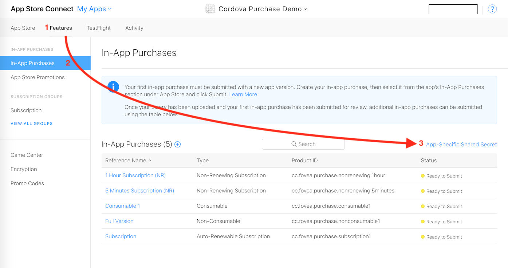
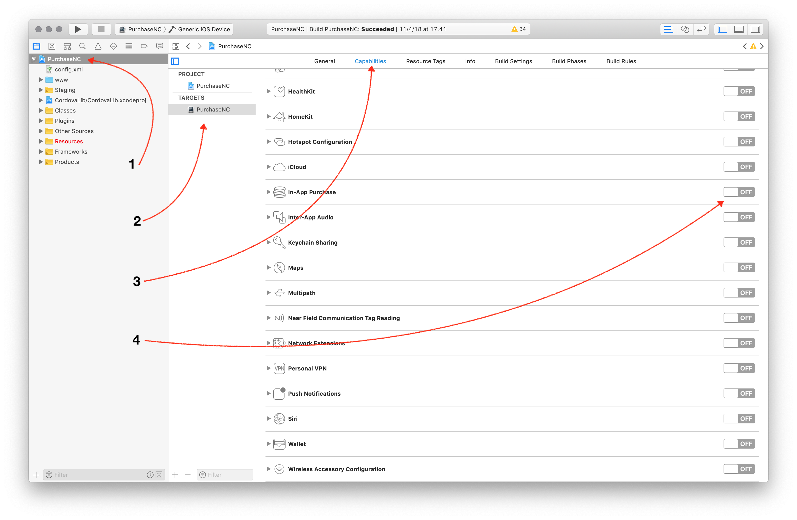

# Subscription on iOS

In this guide, we will build a small application with a subscription that works on iOS.

We will proceed in 4 steps: setup, initialization, presentation and purchase.

Here what we'll do.

1. Install Dependencies
2. Create Cordova Project
3. Setup AppStore Application
4. Install and Prepare with XCode
5. Create In-App Products

Of couse you can skip the first few steps if you already have a working application you want to integrate the code into.

Once we have a Cordova iOS application with IAP support enabled and everything is in place on AppStore Connect, we will get into some coding.

1. Initialize the in-app purchase plugin
2. Handle the purchase events
3. Deliver our product
4. Secure the transactions


# Setup

## 1. Install Dependencies

Needless to say, make sure you have the tools installed on your machine. Developing from a mac is generally recommended for doing iOS development, it's way easier. If you only plan on doing Android, then everything will work.

During the writing of this guide, I've been using the following environment:

* **NodeJS** v10.12.0
* **Cordova** v8.1.2
* **macOS** 10.14.1

I'm not saying it won't work with different version. If you start fresh, it might be a good idea to use an up-to-date environment.

## 2. Create Cordova Project

### Create the project

If it isn't already created:

```text
$ cordova create CordovaProject cc.fovea.purchase.demo PurchaseNC
Creating a new cordova project.
```

For details about what those parameters are:

```text
$ cordova help create
```

Note, feel free to pick a different project ID and name. Remember whatever values you put in here.

Let's head into our cordova project's directory \(should match whatever we used in the previous step.

```text
$ cd CordovaProject
```

### Add iOS platform

```text
$ cordova platform add ios
```

## 3. Setup AppStore Application

First, I assume you have an Apple developer account. If not time to register, because it's mandatory.

Let's now head to the [AppStore Connect](https://appstoreconnect.apple.com) website. In order to start developing and testing In-App Purchases, you need all contracts in place as well as your financial information setup. Make sure there are no warning left there.

I'll not guide you through the whole procedure, just create setup your Apple application as usual.

### Retrieve the Shared Secret

Since you are here, let's retrieve the Shared Secret. You can use an App-Specific one or a Master Shared Secret, at your convenience: both will work. Keep the value around, it'll be required, especially if you are implementing subscriptions.




## 4. Install and Prepare with XCode

When you only require iOS support, no need for special command line arguments:

```text
$ cordova plugin add cc.fovea.cordova.purchase
```

You then have to activate the In-App Purchase capability manually for your application using Xcode. Unfortunately it's not something the plugin can do automatically. So let's first prepare the iOS project:

```text
$ cordova prepare ios
```

Then open the project on Xcode:

```text
$ open platforms/ios/*.xcodeproj
```

Get to the project's settings by clicking on the project's icon, which is the top-most item in the left-side pane tree view.

Select the target, go to _Capabilities_, scroll down to _In-App Purchase_ and make sure it's **"ON".**



Now try to **build the app from Xcode**. It might point you to a few stuff it might automatically fix for you if you're starting from a fresh project, like selecting a development team and creating the signing certificate. So just let Xcode do that for you except if you have a good reason not to and know what you're doing.

Successful build? You're good to go!

## 5. Create In-App Products

If you followed the [Setup AppStore Application](3.-create-app-store-application.md) page, you should have everything setup. Head again to the App's In-App Purchases page: select your application, then _Features_, then _In-App Purchases_.

From there you can create your In-App Products. Select the appropriate type, fill in all required metadata and select _cleared for sale_.


Even if that sounds stupid, you need to fill-in ALL metadata in order to use the In-App Product in development, even the screenshot for reviewers. Make sure you have at least one localization in place too.


The process is well explained by Apple, so I'll not enter into more details.

## 6. Create Test Users

In order to test your In-App Purchases during development, you should create some test users.


# Coding


