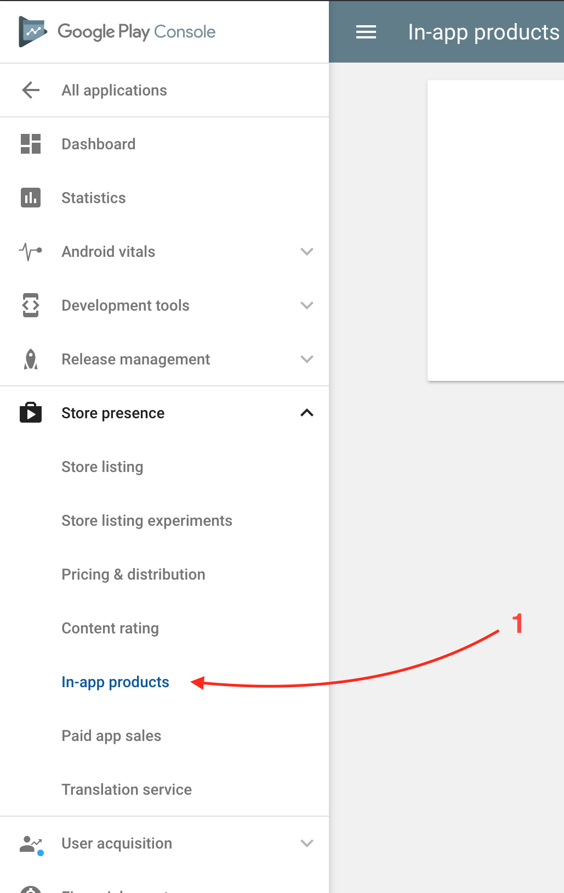

## Setup for Google Play

This guide details the necessary steps to configure your development environment, Google Play Console, and application settings before implementing In-App Purchases for Android using `cordova-plugin-purchase` v13+.


**Platform Interfaces Change Frequently!**

The Google Play Console interface and Google's requirements (like API access or testing procedures) can change. This guide provides a general overview based on common practices but may become outdated.

**Always refer to the official Google documentation as the primary source:**
*   [Google Play Billing Overview](https://developer.android.com/google/play/billing/billing_overview)
*   [Set up Google Play Billing](https://developer.android.com/google/play/billing/integrate)
*   [Create & Manage Products/Subscriptions](https://developer.android.com/google/play/billing/subscriptions)
*   [Testing Google Play Billing](https://developer.android.com/google/play/billing/test)
*   [Google Play Console Help](https://support.google.com/googleplay/android-developer/)
*   [Setting up Google Play Developer API Access](https://developers.google.com/android-publisher/getting_started) (Needed for Server-Side Validation)


### 1. Install Dependencies

Ensure you have the basic development tools installed (Node.js, Cordova CLI, Android SDK/Studio).


Needless to say, make sure you have the tools installed on your machine. During the writing of this guide, I've been using the following environment:

* **NodeJS** v10.12.0
* **Cordova** v8.1.2
* **macOS** 10.14.1

I'm not saying it won't work with different version. If you start fresh, it might be a good idea to use an up-to-date environment.


### 2. Create or Prepare Cordova Project

Set up your Cordova project and add the Android platform.


Making sure we have a Cordova project that we can build for Android and/or iOS.

#### Create the project


#### Create the project

If it isn't already created:

```text
$ cordova create CordovaProject cc.fovea.purchase.demo PurchaseNC
Creating a new cordova project.
```

For details about what those parameters are:

```text
$ cordova help create
```

Note, feel free to pick a different project ID and name. Remember whatever values you put in here.

Let's head into our cordova project's directory \(should match whatever we used in the previous step.

```text
$ cd CordovaProject
```

#### Add Android platform

```text
$ cordova platform add android
```

Will output:

```text
    Using cordova-fetch for cordova-android@~11.0.0
    Adding android project...
    [...]
    Saving android@~11.0.0 into config.xml file ...
```

Let's check if that builds.

```text
$ cordova build android
```

Which outputs:

```text
    Android Studio project detected
    Starting a Gradle Daemon (subsequent builds will be faster)
    [...]
    BUILD SUCCESSFUL in 1m 49s
    Built the following apk(s):
    __EDITED__/platforms/android/app/build/outputs/apk/debug/app-debug.apk
```

Hopefully there's no problems with our Android build chain. If you do have problems, fixing it is out of scope from this guide but it's required!


*   **Important:** Ensure the `<widget id="...">` in your `config.xml` **exactly matches** the **Package Name** (Application ID) you will use in the Google Play Console.

### 3. Setup Google Play Console Application & Billing

Configure your app record and billing settings in the Google Play Console.

*   **Google Play Developer Account:** You need an active Google Play Developer account ([Play Console](https://play.google.com/console/)).
*   **Create Application:** Create your application entry in the Play Console if it doesn't exist yet. Use the same Package Name as in your `config.xml`.
*   **Billing Setup:** Ensure you have set up a Payments Profile linked to your developer account (usually under "Setup" -> "Payments profile"). It must be active to test or publish IAPs.
*   **License Testing:** Add the Google account(s) (full Gmail addresses) you will use for testing under "Setup" -> "License testing". These accounts can make test purchases without being charged.


Make sure we have a Google Play application created and configured.

### Create the App

* Open the [Google Play Console](https://play.google.com/apps/publish).
* Click "Create Application", fill in the required fields.


Need more help? I recommend you check [Google's own documentation](https://support.google.com/googleplay/android-developer/answer/113469?hl=en&ref_topic=7072031). It's well detailed, easy to follow and probably the most up-to-date resource you can find.



### 4. Install Plugin and Configure Project

Install the purchase plugin. The necessary AndroidManifest permission is added automatically.

1.  **Install Plugin:**
    ```bash
    cordova plugin add cordova-plugin-purchase
    ```
2.  **Verify `config.xml` ID:** Double-check that the `<widget id="...">` matches your Google Play Package Name.
3.  **Verify `AndroidManifest.xml`:** After running `cordova prepare android`, you can optionally check `platforms/android/app/src/main/AndroidManifest.xml` to ensure the following permission is present (the plugin adds it):
    ```xml
    <uses-permission android:name="com.android.vending.BILLING" />
    ```


To install the plugin, we will use the usual `cordova plugin add` command.

```text
cordova plugin add cordova-plugin-purchase"
```

Now let's try to build.

```text
cordova build android
```

Successful build?

```text
[...]
BUILD SUCCESSFUL in 2s
```

All good! Seems like we can build an app with support for the Billing API.

Let's now prepare a release APK.


### 5. Create In-App Products in Google Play Console

Define the specific items (consumables, non-consumables, subscriptions) you want to sell.

*   Navigate to your app in the Play Console.
*   Go to the "Monetize" section -> "Products" or "Subscriptions".
*   Click "Create product" or "Create subscription".
*   Fill in all required details: **Product ID** (unique, used in `store.register`), Name, Description, Price.
*   **Activate** the product/subscription.


There is still a bit more preparatory work: we need to setup our in-app product.

Back in the "Google Play Console", open the "Store presence" ⇒ "In-app products" section.



If you haven't yet uploaded an APK, it'll warn you that you need to upload a *release* APK.

Once this is done, you can create a product. Google offers 2 kinds of products:

* Managed Products
* Subscriptions

The latest is for auto-renewing subscriptions, in all other cases, you should a "Managed Product".

* Click the **CREATE** button.
* Fill in all the required information \(title, description, prices\).
* Make sure the Status is **ACTIVE**.
* **SAVE**

And we're done!


There's might be some delay between creating a product on the Google Play Console and seeing it in your app. If your product doesn't show up after 24h, then you should start to worry.



*(Review included content for consistency)*
*   **Product IDs:** Note down the exact Product IDs.

### 6. Build and Upload a Signed Build for Testing

**CRITICAL STEP:** Google Play Billing requires a **release-signed build** to be uploaded to a testing track before IAPs (even test purchases) will work correctly. Debug builds **will not work**.

1.  **Generate Release Key:** If you don't have one, create a Java Keystore (`.keystore` or `.jks`) using `keytool`. **Back up this file and its passwords securely!** You need it for all future updates.
    ```bash
    keytool -genkey -v -keystore my-release-key.keystore -alias mykeyalias -keyalg RSA -keysize 2048 -validity 10000
    ```
2.  **Build Signed APK/AAB:** Use the Cordova CLI with build configuration or Android Studio, ensuring you sign with your release key. A helper script can simplify this:


To generate a release build, I generally use the following script: [android-release.sh](https://gist.github.com/j3k0/28f60a7d5622508634d09f94c59d6dfc)

The script calls `cordova build android --release` with the correct command line arguments. It requires you have generated a `keystore` file for your application already.

If you haven't generated a keystore file for your application yet, you can use the following command line:

```text
keytool -genkey -v -keystore android-release.keystore -alias release \
-keyalg RSA -keysize 2048 -validity 10000
```

I'll ask you a few questions. The only tricky one is "Do you wan't to use the same password for the alias?", the answer is _yes_. Please note that the above command defines the keystore's `alias` as **release**, you can use any value, but just remember the value you chose.

Keep the `android-release.keystore` file in a safe place, backup it everywhere you can! Don't loose it, don't loose the password. You won't EVER be able to update your app on Google Play without it!

Then build.

```text
$ export KEYSTORE_ALIAS=release
$ export KEYSTORE_PASSWORD=my_password
$ ./android-release.sh
```

Replace `$KEYSTORE_ALIAS` and `$KEYSTORE_PASSWORD` with whatever match your those from your `keystore` file...

The output should end with a line like this:

```text
Build is ready:

<SOME_PATH>/android-release-20181015-1145.apk
```

There you go, this is your first release APK.


3.  **Upload to Play Console:**
    *   Go to **Release -> Testing -> Internal testing** (recommended) or Closed testing.
    *   Create a new release and **upload the signed APK or AAB**.
    *   Add your **License Tester** email addresses (from Step 3) to the tester list for this track.
    *   Save and **roll out** the release. It may take time (minutes to hours) to become available to testers.


Once you have built your release APK, you need to upload it to Google Play in order to be able to test In-App Purchases. In-App Purchase is not enabled in "debug build". In order to test in-app purchase, your APK needs to be signed with your release signing key. In order for Google to know your release signing key for this application, you need to upload a release APK:

* Signed with this key.
* Have the BILLING permission enabled
  * it is done when you add the plugin to your project, so make sure you didn't skip this step.

Google already provides [detailed resource on how to upload a release build](https://support.google.com/googleplay/android-developer/answer/7159011). What we want here is to:

1. create an **internal testing release**
2. **upload** it
3. **publish** it \(privately probably\).

Once you went over those steps, you can test your app with in-app purchase enabled without uploading to Google Play each time, but you need to sign the APK with the same "release" signing key.


Note that it might up to 24 hours for your IAP to work after you uploaded the first release APK.



### 7. Configure Test Device

*   Use a **physical Android device**.
*   Log into the device **only** with a Google account that is listed as a **License Tester** and is part of the **testing track** you uploaded the build to.
*   Install the app **from the Google Play Store** using the testing link/invitation provided by the Play Console. **Do not** install manually via `adb` if possible, as this can cause issues.


To test your Google Play Billing implementation with actual in-app purchases, you must use a test account. By default, the only test account registered is the one that's associated with your developer account. You can register additional test accounts by using the Google Play Console.

1. Navigate to Settings > Account details.
2. In the License Testing section, add your tester's email addresses to Gmail accounts with testing access field.
3. Save your changes.


Testers can begin making purchases of your in-app products within 15 minutes.



### 8. (Recommended) Setup Receipt Validation Service

Server-side validation is essential for security and reliable subscription management.


### 9. Setup Receipt Validation Server (Google Play)

Reliably managing Android subscriptions, especially determining the exact expiry date and renewal status, requires communication with the **Google Play Developer API**. The purchase plugin itself does not directly communicate with this server-side API. You need an intermediary service for this, often referred to as a receipt validation server.

While you can build your own server to interact with the Google Play Developer API, this guide will use **Iaptic** (the service developed by the plugin's author) which simplifies this process.

**Why is this needed for Android Subscriptions?**

*   **Accurate Expiry Dates:** Local receipt data on Android doesn't always contain a reliable expiry date, especially after renewals or cancellations. The Google Play Developer API is the source of truth.
*   **Renewal Status:** Checking if a subscription will auto-renew or has been cancelled requires server-side checks.
*   **Grace Periods & Account Hold:** Handling billing issues requires server-side status information.

**Steps using Iaptic:**

1.  **Create an Iaptic Account:** If you haven't already, sign up at [iaptic.com](https://www.iaptic.com/).
2.  **Connect with Google Play Developer API:**
    *   Navigate to your Iaptic project settings.
    *   Find the "Google Play" section.
    *   Follow the instructions provided by Iaptic to connect your Google Play Developer account. This typically involves:
        *   Creating a **Service Account** in your Google Cloud Console project that is linked to your Google Play Developer Console.
        *   Granting the necessary permissions (like "View financial data" and "Manage orders and subscriptions") to this Service Account within the Google Play Console.
        *   Uploading the JSON key file for the Service Account to Iaptic.
    *   Iaptic provides detailed guides for this process: [Connect With Google](https://www.iaptic.com/documentation/connect-with-google-publisher-api/)
3.  **Configure the Plugin:**
    *   Go to the "Setup" section in your Iaptic dashboard and find the "Cordova" setup instructions.
    *   Copy the provided `store.validator` URL. It will look something like `https://validator.iaptic.com/...`.
    *   Paste this URL into your application's initialization code where you configure the store validator:

    ```javascript
    // In your initStore() or equivalent function
    const iaptic = new CdvPurchase.Iaptic({
      appName: "[Your Iaptic App Name]", // Replace with your actual App Name
      apiKey: "[Your Iaptic Public Key]" // Replace with your actual Public Key
    });
    CdvPurchase.store.validator = iaptic.validator;
    ```

    *   Ensure your `Content-Security-Policy` in `index.html` allows connections to `validator.iaptic.com` (or your custom Iaptic domain).


Iaptic's validation service is often free or has a generous free tier during development (using test purchases) and offers paid plans for production use. Check their pricing for details.



Skipping this server-side validation step for Android subscriptions will lead to unreliable expiry date information and difficulty in managing subscription states correctly.


With the validator configured and connected to the Google Play Developer API, the plugin, via Iaptic, can now retrieve accurate subscription details during the validation process.

*   **Remember:** You'll need **Google Play Developer API access** (via a Service Account JSON key) configured on your validation server.

---

After completing these steps, your Google Play Console, application build, and test device should be configured to support In-App Purchases using `cordova-plugin-purchase`. You can now proceed to implement the purchase logic in your application code as shown [here](/../setup/code-framework.md).
