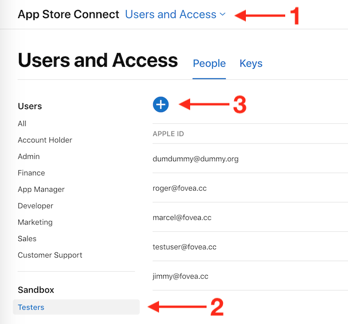

# Consumable on iOS

We will proceed in 4 steps: setup, initialization, presentation and purchase.

Here what we'll do.

1. Install Dependencies
2. Create Cordova Project
3. Setup AppStore Application
4. Install and Prepare with XCode
5. Create In-App Products
6. Prepare Test Accounts

Of couse you can skip the first few steps if you already have a working application you want to integrate the code into.

Once we have a Cordova iOS application with IAP support enabled and everything is in place on AppStore Connect, we will get into some coding.

1. Initialize the in-app purchase plugin
2. Handle the purchase events
3. Deliver our product
4. Secure the transactions


## Setup

### 1. Install Dependencies

Needless to say, make sure you have the tools installed on your machine. Developing from a mac is generally recommended for doing iOS development, it's way easier. If you only plan on doing Android, then everything will work.

During the writing of this guide, I've been using the following environment:

* **NodeJS** v10.12.0
* **Cordova** v8.1.2
* **macOS** 10.14.1

I'm not saying it won't work with different version. If you start fresh, it might be a good idea to use an up-to-date environment.

### 2. Create Cordova Project

#### Create the project

If it isn't already created:

```text
$ cordova create CordovaProject cc.fovea.purchase.demo PurchaseNC
Creating a new cordova project.
```

For details about what those parameters are:

```text
$ cordova help create
```

Note, feel free to pick a different project ID and name. Remember whatever values you put in here.

Let's head into our cordova project's directory \(should match whatever we used in the previous step.

```text
$ cd CordovaProject
```

#### Add iOS platform

```text
$ cordova platform add ios
```

### 3. Setup AppStore Application

First, I assume you have an Apple developer account. If not time to register, because it's mandatory.

Let's now head to the [AppStore Connect](https://appstoreconnect.apple.com) website. In order to start developing and testing In-App Purchases, you need all contracts in place as well as your financial information setup. Make sure there are no warning left there.

I'll not guide you through the whole procedure, just create setup your Apple application as usual.

#### Retrieve the Shared Secret

Since you are here, let's retrieve the Shared Secret. You can use an App-Specific one or a Master Shared Secret, at your convenience: both will work. Keep the value around, it'll be required, especially if you are implementing subscriptions.


### 4. Install and Prepare with XCode

When you only require iOS support, no need for special command line arguments:

```text
$ cordova plugin add cordova-plugin-purchase
```

You then have to activate the In-App Purchase capability manually for your application using Xcode. Unfortunately it's not something the plugin can do automatically. So let's first prepare the iOS project:

```text
$ cordova prepare ios
```

Then open the project on Xcode:

```text
$ open platforms/ios/*.xcodeproj
```

Get to the project's settings by clicking on the project's icon, which is the top-most item in the left-side pane tree view.

Select the target, go to _Capabilities_, scroll down to _In-App Purchase_ and make sure it's **"ON".**


Now try to **build the app from Xcode**. It might point you to a few stuff it might automatically fix for you if you're starting from a fresh project, like selecting a development team and creating the signing certificate. So just let Xcode do that for you except if you have a good reason not to and know what you're doing.

Successful build? You're good to go!

### 5. Create In-App Products

If you followed the [Setup AppStore Application](#3-setup-appstore-application) section, you should have everything setup. Head again to the App's In-App Purchases page: select your application, then _Features_, then _In-App Purchases_.

From there you can create your In-App Products. Select the appropriate type, fill in all required metadata and select _cleared for sale_.


Even if that sounds stupid, you need to fill-in ALL metadata in order to use the In-App Product in development, even the screenshot for reviewers. Make sure you have at least one localization in place too.


The process is well explained by Apple, so I'll not enter into more details.

### 6. Create Test Users

In order to test your In-App Purchases during development, you should create some test users.

You can do so from the AppStore Connect website, in the _Users & Access_ section. There in the sidebar, you should see "Sandbox > Testers". If you don't, it means you don't have enough permissions to create sandbox testers, so ask your administrator.

From there, it's just a matter of hitting "+" and filling the form. While you're at it, create 2-3 test users: it will be handy for testing.




## Coding


### Initialization

Assuming you're starting from a blank project, we'll add the minimal amount of HTML for the purpose of this tutorial. Let's replace the `<body>` from the `www/index.html` file with the below.

```markup
<body>
  <div class="app">
    <p id="gold-coins">Gold:</p>
    <div id="consumable1-purchase">Please wait...</div>
  </div>
  <script type="text/javascript" src="cordova.js"></script>
  <script type="text/javascript" src="js/index.js"></script>
</body>
```

Let's also make sure to comment out Cordova template project's CSS.

You also need to enable the `'unsafe-inline'` `Content-Security-Policy` by adding it to the `default-src` section:

```markup
<meta http-equiv="Content-Security-Policy"
      content="default-src 'self' 'unsafe-inline' [...]" />
```

You can download the [full index.html file here](https://gist.github.com/j3k0/3324bb8e759fef4b3054b834a5a88500#file-index-html).

We will now create a new JavaScript file and load it from the HTML. The code below will initialize the plugin.

```javascript
document.addEventListener('deviceready', initStore);

function initStore() {

    if (!window.store) {
        console.log('Store not available');
        return;
    }

    store.register({
        id:    'consumable1',
        alias: 'my_consumable1',
        type:   store.CONSUMABLE
    });

    store.error(function(error) {
        console.log('ERROR ' + error.code + ': ' + error.message);
    });
    
    // ... MORE HERE SOON

    store.refresh();
}
```

Here's a little explanation:

**Lines 5-8**, we check if the plugin is loaded.

**Lines 10-14**, we register the product with ID `consumable1`. We declare it as a consumable \(`store.CONSUMABLE`\). [⇒ API Documentation](https://github.com/j3k0/cordova-plugin-purchase/blob/master/doc/api.md#registering-products).

**Lines 16-18**, we setup an error handler. It just logs errors to the console.

**Line 22**, we perform the initial `refresh()` of all products states. [⇒ API Documentation](https://github.com/j3k0/cordova-plugin-purchase/blob/master/doc/api.md#registering-products).


Whatever your setup is, you should make sure this runs as soon as the javascript application starts. You have to be ready to handle IAP events as soon as possible.


### Presentation

For the sake of this tutorial's simplicity, let's store the user's number of gold coins in localStorage:`window.localStorage.goldCoins`

When the app starts, we'll refresh the `#gold-coins` html element:

```javascript
function refreshGoldCoinsUI() {
    document.getElementById('gold-coins').textContent =
        'GOLD: ' + (window.localStorage.goldCoins | 0);
}

document.addEventListener('deviceready', refreshGoldCoinsUI);
```

This part was easy,. Now for a bit more challenge, let's display the title, description and price of the virtual product for purchasing more gold. `consumable1` that we registered in the initialization code above.

We'll add a little more at `initStore()` function, line 20.

```javascript
store.when('my_consumable1').updated(refreshProductUI);
```

Then define the `refreshProduct()` function at the bottom of the file.

```javascript
function refreshProductUI(product) {
    const info = product.loaded
        ? `title: ${product.title}<br/>` +
          `desc: ${product.description}<br/>` +
          `price: ${product.price}<br/>`
        : 'Retrieving info...';
    const button = product.canPurchase
         ? '<button onclick="purchaseConsumable1()">Buy Now!</button>'
         : '';
    const el = document.getElementById('consumable1-purchase');
    el.htmlContent = info + button;
}
```

**Lines 2**, check if the product has been loaded.

**Lines 3-5**, retrieve and display product informations.

**Lines 7-8**, add the "Buy Now!" button if product can be purchased.

If you want a bit more background information about this, please check the [Displaying Products ](../discover/about-the-plugin.md#displaying-products)section and the [⇒ API Documentation](https://github.com/j3k0/cordova-plugin-purchase/blob/master/doc/api.md#storeproduct-object) for full details about the fields found for a product.

Let's build and test that!


### Testing

To test with In-App Purchases enabled, I chose to run my app through Xcode. This way, I can see the logs from both the javascript and native sides, which is useful.

To make a build, first update the Xcode project on the console.

```text
cordova prepare ios
```

Then switch to Xcode and run.

### Purchase

Now that we have our purchase button, let's implement the `purchaseConsumable1` button.

```javascript
function purchaseConsumable1() {
    store.order('my_consumable1');
}
```

Can it be easier than that? Well, not so fast! The code as it is won't do much with this order request. To process the purchase we have to implement the various steps of the purchase flow.

I already introduced the purchase flow in the introduction of this guide, check the [Purchase process](../discover/about-the-plugin.md#purchase-process) section if you need a refresher. The official documentation provides more details. [⇒ API Documentation](https://github.com/j3k0/cordova-plugin-purchase/blob/master/doc/api.md#-purchasing) 

So the first thing that will happen is that the `canPurchase` state of the product will change to `false`. But remember, we added this in the previous step:

```javascript
store.when('my_consumable1').updated(refreshProductUI);
```

So we're covered. The UI will be refreshed when `canPurchase` changes, it will not be possible to hit _Purchase_, until `canPurchase` becomes true again.

When the user is done with the native interface \(enter his/her password and confirm\), you'll receive the `approved` event, let's handle it by adding the below to the `initStore()` function, before the call to `store.refresh()`.

```javascript
store.when('my_consumable1').approved(function(p) {
    p.verify();
});
```

```javascript
store.when('my_consumable1').verified(finishPurchase);
```

Then we will add the `finishPurchase` function at the end of our JavaScript file.

```javascript
function finishPurchase(p) {
    window.localStorage.goldCoins += 10;
    refreshGoldCoinsUI();
    p.finish();
}
```

This is a good enough implementation, but let's go one step further and setup a receipt validator. This is optional, but it prevents the easiest for of hacking, so generally a good idea.

For this tutorial, we will use Fovea's own service which is free during development. You can implement your own receipt validation service later if you like.

1. Head to [https://billing.fovea.cc/](https://billing.fovea.cc/) and create an Account.
2. Setup your project's iOS bundle ID and shared secret, Save.
3. Go to the [Cordova Setup](https://billing-dashboard.fovea.cc/setup/cordova) page to copy the line `store.validator = "<something>"`.

Copy this line inside the `initStore()` function, anywhere before the initial `store.refresh()`. Also add the recommended `Content-Security-Policy` to your `index.html` as mentioned in the documentation.

Alright, we're done with coding! Let's try the whole thing now. Repeat the steps from the [Testing](#testing) section above:

```text
cordova prepare ios
```

Run from Xcode and here you go!

Full source for this tutorial is available here: [https://gist.github.com/j3k0/3324bb8e759fef4b3054b834a5a88500](https://gist.github.com/j3k0/3324bb8e759fef4b3054b834a5a88500)

