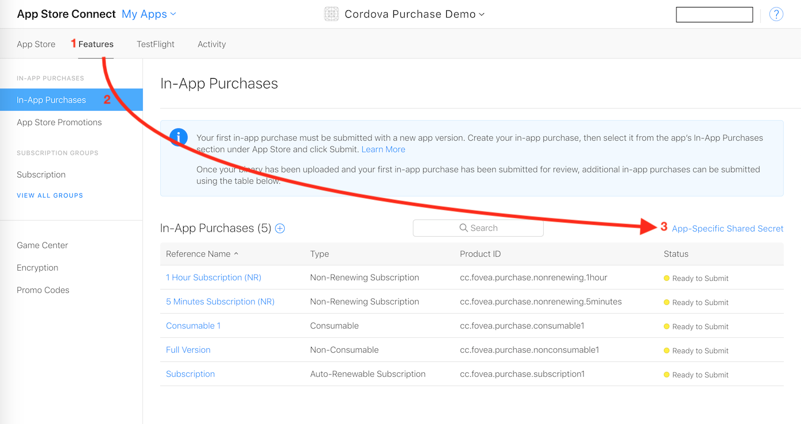
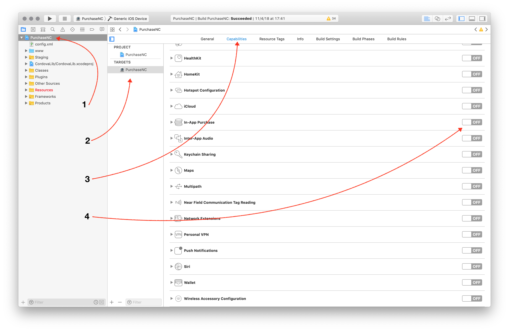
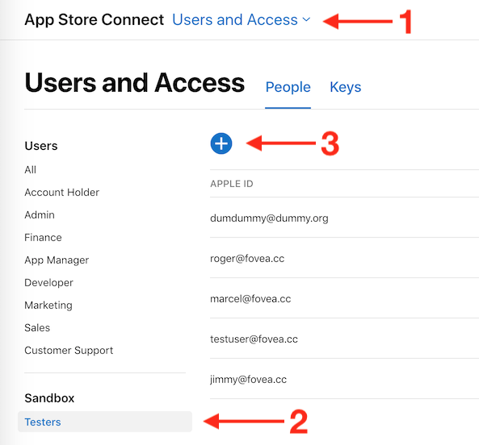

# Non-Consumable Product for iOS & macOS


# Non-Consumable on iOS


## Setup for iOS AppStore


**Platform Interfaces Change Frequently!**

The App Store Connect interface and Apple's requirements change often. This guide provides a general overview but may become outdated.

**Always refer to the official Apple documentation as the primary source:**
*   [App Store Connect Help](https://help.apple.com/app-store-connect/)
*   [In-App Purchase Configuration](https://developer.apple.com/help/app-store-connect/configure-in-app-purchase-settings/overview-for-configuring-in-app-purchases)


This section covers the essential steps for setting up your iOS/macOS app for In-App Purchases with the Cordova plugin.

### 1. Install Dependencies


Needless to say, make sure you have the tools installed on your machine. During the writing of this guide, I've been using the following environment:

* **NodeJS** v10.12.0
* **Cordova** v8.1.2
* **macOS** 10.14.1

I'm not saying it won't work with different version. If you start fresh, it might be a good idea to use an up-to-date environment.


### 2. Create Cordova Project

#### Create the project

If it isn't already created:

```text
$ cordova create CordovaProject cc.fovea.purchase.demo PurchaseNC
Creating a new cordova project.
```

For details about what those parameters are:

```text
$ cordova help create
```

Note, feel free to pick a different project ID and name. Remember whatever values you put in here.

Let's head into our cordova project's directory \(should match whatever we used in the previous step.

```text
$ cd CordovaProject
```
#### Add iOS platform

```text
$ cordova platform add ios
```


### 3. Setup AppStore Application & Agreements

*   **Apple Developer Account:** Ensure you have an active Apple Developer Program membership.
*   **App Record:** Create an App Record for your application in [App Store Connect](https://appstoreconnect.apple.com).
*   **Agreements, Tax, and Banking:** Ensure all agreements are accepted and banking/tax information is complete in the "Agreements, Tax, and Banking" section of App Store Connect. Your app won't be able to process purchases otherwise.
*   **Bundle ID:** Verify the Bundle ID in App Store Connect exactly matches the `id` in your `config.xml`.


First, I assume you have an Apple developer account. If not time to register, because it's mandatory.

Let's now head to the [AppStore Connect](https://appstoreconnect.apple.com) website. In order to start developing and testing In-App Purchases, you need all contracts in place as well as your financial information setup. Make sure there are no warning left there.

I'll not guide you through the whole procedure, just create setup your Apple application as usual.

#### Retrieve the Shared Secret

Since you are here, let's retrieve the Shared Secret. You can use an App-Specific one or a Master Shared Secret, at your convenience: both will work. Keep the value around, it'll be required, especially if you are implementing subscriptions.




### 4. Install and Prepare with XCode


When you only require iOS support, no need for special command line arguments:

```text
$ cordova plugin add cordova-plugin-purchase
```

You then have to activate the In-App Purchase capability manually for your application using Xcode. Unfortunately it's not something the plugin can do automatically. So let's first prepare the iOS project:

```text
$ cordova prepare ios
```

Then open the project on Xcode:

```text
$ open platforms/ios/*.xcodeproj
```

Get to the project's settings by clicking on the project's icon, which is the top-most item in the left-side pane tree view.

Select the target, go to _Capabilities_, scroll down to _In-App Purchase_ and make sure it's **"ON".**



Now try to **build the app from Xcode**. It might point you to a few stuff it might automatically fix for you if you're starting from a fresh project, like selecting a development team and creating the signing certificate. So just let Xcode do that for you except if you have a good reason not to and know what you're doing.

Successful build? You're good to go!


### 5. Create In-App Products

### 5. Create In-App Products

If you followed the [Setup AppStore Application](#3-setup-appstore-application) section, you should have everything setup. Head again to the App's In-App Purchases page: select your application, then _Features_, then _In-App Purchases_.

From there you can create your In-App Products. Select the appropriate type, fill in all required metadata and select _cleared for sale_.


Even if that sounds stupid, you need to fill-in ALL metadata in order to use the In-App Product in development, even the screenshot for reviewers. Make sure you have at least one localization in place too.


The process is well explained by Apple, so I'll not enter into more details.


### 6. Create Test Users

### 6. Create Test Users

In order to test your In-App Purchases during development, you should create some test users.

You can do so from the AppStore Connect website, in the _Users & Access_ section. There in the sidebar, you should see "Sandbox > Testers". If you don't, it means you don't have enough permissions to create sandbox testers, so ask your administrator.

From there, it's just a matter of hitting "+" and filling the form. While you're at it, create 2-3 test users: it will be handy for testing.




## Code Implementation

This section details the minimal code required to implement a non-consumable product (like unlocking a feature or removing ads) on iOS and macOS using the AppStore platform.

### Base framework

First, let's set up the basic HTML structure and the initial JavaScript to load the plugin.


#### index.html

Assuming you're starting from a blank project, we'll add the minimal amount of HTML for the purpose of this tutorial. Let's replace the `<body>` from the `www/index.html` file with the below.

```markup
<body>
  <div id="app"></div>
  <script type="text/javascript" src="cordova.js"></script>
  <script type="text/javascript" src="js/index.js"></script>
</body>
```

Let's also make sure to comment out Cordova template project's CSS.

You also need to enable the `'unsafe-inline'` `Content-Security-Policy` by adding it to the `default-src` section:

```markup
<meta http-equiv="Content-Security-Policy"
      content="default-src 'self' 'unsafe-inline' [...]" />
```

You can download the [full index.html file here](https://gist.github.com/j3k0/80c69837e5bacf83c4fc2320ba2e5dc2).
#### javascript


We will now create a new JavaScript file and load it from the HTML. The code below will initialize the plugin.


```javascript
document.addEventListener('deviceready', onDeviceReady);

function onDeviceReady() {

  if (!window.CdvPurchase) {
      console.log('CdvPurchase is not available');
      return;
  }
  const {store} = CdvPurchase;

  store.error(function(error) {
      console.log('ERROR ' + error.code + ': ' + error.message);
  });

  store.ready(function() {
    console.log("CdvPurchase is ready");
  });
 
  initializeStore();
  refreshUI();
}

function initializeStore() {
  // We will implement this soon
}

function refreshUI() {
  // Soon...
}
```


Here's a little explanation:

**Line 1**, it's important to wait for the "deviceready" event before using cordova plugins.

**Lines 5-8**, we check if the plugin was correctly loaded.

**Lines 11-13**, we setup an error handler. It just logs errors to the console.

> Whatever your setup is, you should make sure this runs as soon as the javascript application starts. You have to be ready to handle IAP events as soon as possible.

### Initialization & Presentation

Now, we'll initialize the plugin, register our non-consumable product, and set up the UI to display its status and purchase options. This involves:
*   Registering the product with type `NON_CONSUMABLE`.
*   Displaying product details (title, description, price).
*   Showing a "Buy" or "Unlock" button only when the product `canPurchase`.
*   Reflecting the unlocked status in the UI (e.g., showing the premium feature or hiding ads).

### Initialization & UI Setup (Non-Consumable)

This section guides you through setting up the initial HTML and JavaScript required to initialize the purchase plugin, register your non-consumable product, and display its information to the user before they attempt a purchase.

**Step 1: Basic HTML Structure**

*   **What:** We need a place in our HTML to display the status of the feature (locked/unlocked) and the details of the in-app product used to unlock it.
*   **Why:** This provides visual feedback to the user about the product and their current access level.

Replace the `<body>` of your `www/index.html` with this minimal structure:

```markup
<!-- www/index.html -->
<body>
  <div class="app">
    <h1>My App Feature</h1>
    <p id="feature-status">Feature Status: Loading...</p>
    <hr/>
    <div id="nonconsumable1-purchase">
      <h2>Unlock Feature</h2>
      <p>Loading purchase details...</p>
    </div>
    <hr/>
    <!-- Placeholder for error messages -->
    <div id="error-display" style="color: red; margin-top: 10px;"></div>
  </div>
  <script type="text/javascript" src="cordova.js"></script>
  <script type="text/javascript" src="js/index.js"></script>
</body>
```

*   Remember to adjust your `Content-Security-Policy` meta tag in `index.html` if you plan to use a remote validator or load external resources. Add `'unsafe-inline'` if you use `onclick` attributes directly.

**Step 2: Initial JavaScript Framework**

*   **What:** Create `www/js/index.js` and set up the essential event listener for `deviceready`.
*   **Why:** Cordova plugins are only guaranteed to be available *after* the `deviceready` event fires. All plugin interactions must happen after this point.

```javascript
// www/js/index.js

// Wait for Cordova to be ready
document.addEventListener('deviceready', initializeStore);
document.addEventListener('deviceready', refreshFeatureUI); // Refresh UI once device is ready

// Key for storing unlock status (using localStorage for simplicity)
const FEATURE_KEY = 'myFeatureUnlocked';

function initializeStore() {
    console.log('Device is ready, initializing store...');

    // Check if the CdvPurchase plugin is available
    if (!window.CdvPurchase || !window.CdvPurchase.store) {
        console.error('Store plugin not available');
        document.getElementById('feature-status').textContent = 'Error: Store plugin failed to load.';
        return;
    }

    const { store, ProductType, Platform, LogLevel } = CdvPurchase;
    console.log('Store plugin version: ' + store.version);

    // Optional: Set log level for debugging
    store.verbosity = LogLevel.DEBUG; // Use DEBUG for development, ERROR or QUIET for production

    // --- Steps below will be added incrementally ---

    // 1. Register Products
    // 2. Setup Error Handling
    // 3. Setup Event Listeners
    // 4. Initialize the Store

}

// --- UI Refresh Functions ---
// We will implement these functions in the next steps

function refreshFeatureUI() {
    console.log('Refreshing feature UI based on stored status...');
    // (Implementation in Step 6)
}

function refreshProductUI(product) {
    console.log('Refreshing product UI for: ' + (product ? product.id : 'N/A'));
    // (Implementation in Step 7)
}

// --- Purchase Action ---
// We will define this function later, it will be called by the buy button.
// window.purchaseFeature = function() { ... };
```

**Step 3: Register Your Product**

*   **What:** Tell the plugin about your non-consumable product using `store.register()`.
*   **Why:** The plugin needs to know the `id`, `type`, and `platform` of the products you want to manage so it can fetch their details (like price and title) from the respective app store.

Add the following inside the `initializeStore` function (where indicated by the comment):

```javascript
// Inside initializeStore()

// 1. Register Products
console.log('Registering products...');
// Replace 'nonconsumable1' with your actual product ID for the platform.
// Use store.defaultPlatform() for convenience if supporting only one platform initially.
store.register({
    id: 'nonconsumable1', // <<< YOUR PRODUCT ID HERE
    type: ProductType.NON_CONSUMABLE,
    platform: store.defaultPlatform(), // Or Platform.GOOGLE_PLAY, Platform.APPLE_APPSTORE
});
```

**Step 4: Setup Error Handling**

*   **What:** Use `store.error()` to register a listener for any errors the plugin might encounter.
*   **Why:** This helps in debugging and allows you to inform the user if something goes wrong (e.g., network issues, configuration problems).

Add the error handler inside `initializeStore`:

```javascript
// Inside initializeStore()

// 2. Setup Error Handling
console.log('Setting up error handler...');
store.error(function(error) {
    console.error('STORE ERROR ' + error.code + ': ' + error.message);
    const errorEl = document.getElementById('error-display');
    if (errorEl) {
        errorEl.textContent = `Error: ${error.message}`;
        // Clear the error after some time
        setTimeout(() => { if (errorEl.textContent === `Error: ${error.message}`) errorEl.textContent = ''; }, 10000);
    }
});
```

**Step 5: Setup Event Listeners**

*   **What:** Use `store.when()` to listen for specific events, particularly `productUpdated` (when product details like price are loaded) and `receiptUpdated` (when purchase information changes).
*   **Why:** The plugin operates asynchronously. These listeners allow your UI to react when product data is available or when the user's purchase/ownership status changes.

Add the event listeners inside `initializeStore`:

```javascript
// Inside initializeStore()

// 3. Setup Event Listeners
console.log('Setting up event listeners...');
store.when()
    // Called when product data is loaded or updated.
    .productUpdated(product => {
        console.log('Product updated: ' + product.id);
        refreshProductUI(product); // Update the specific product's UI
    })
    // Called when purchase information changes
    .receiptUpdated(receipt => {
        console.log('Receipt updated');
        refreshFeatureUI(); // Re-check feature status based on purchases
    });
    // We will add .approved(), .verified(), .finished() handlers later in the purchase flow section.
```

**Step 6: Initialize the Store**

*   **What:** Call `store.initialize()` to activate the plugin and start communication with the app stores.
*   **Why:** This is the final step to make the plugin operational. It loads product details and existing purchases.

Add the initialization call at the end of `initializeStore`:

```javascript
// Inside initializeStore()

// 4. Initialize the Store
console.log('Initializing store...');
store.initialize([store.defaultPlatform()]) // Initialize only the default platform for this example
    .then(() => {
        console.log("Store initialized successfully");
        // Now that the store is initialized, try to refresh the UI
        // with any products that might have been loaded synchronously (unlikely but safe)
        const product = store.get('nonconsumable1'); // Use your product ID
        if (product) refreshProductUI(product);
        refreshFeatureUI(); // Ensure feature status is checked after init
    })
    .catch(err => {
        console.error("Store initialization failed", err);
        setState({ error: 'Failed to initialize store.', status: 'Error' });
    });
```

**Step 7: Implement UI Updates - Feature Status**

*   **What:** Fill in the `refreshFeatureUI` function to check your application's way of storing the "unlocked" status (here, `localStorage`) and update the corresponding HTML element.
*   **Why:** To show the user whether they have already purchased and unlocked the feature.

Replace the placeholder `refreshFeatureUI` function with this:

```javascript
// In js/index.js

function refreshFeatureUI() {
    console.log('Refreshing feature UI...');
    // Check localStorage (or your preferred storage) for unlock status
    const isUnlocked = window.localStorage.getItem(FEATURE_KEY) === 'YES';
    const statusEl = document.getElementById('feature-status');
    if (statusEl) {
        statusEl.textContent = 'Feature Status: ' + (isUnlocked ? 'UNLOCKED! 🎉' : 'Locked');
        console.log('Feature is ' + (isUnlocked ? 'Unlocked' : 'Locked'));
    } else {
        console.warn('feature-status element not found');
    }

    // It's also good practice to refresh the product UI in case ownership changed `canPurchase`
    const product = CdvPurchase.store.get('nonconsumable1'); // Use your product ID
    if (product) refreshProductUI(product);
}
```

**Step 8: Implement UI Updates - Product Details & Button**

*   **What:** Fill in the `refreshProductUI` function. It receives a `Product` object when the `productUpdated` event fires. Use its properties (`title`, `description`, `pricing`, `canPurchase`) to populate the product details section and decide whether to show the purchase button.
*   **Why:** To display accurate information fetched from the app store and provide a purchase option only when appropriate (product loaded, feature not already unlocked).

Replace the placeholder `refreshProductUI` function with this:

```javascript
// In js/index.js

function refreshProductUI(product) {
    console.log('Refreshing product UI for: ' + (product ? product.id : 'null product'));
    const isUnlocked = window.localStorage.getItem(FEATURE_KEY) === 'YES';
    const el = document.getElementById('nonconsumable1-purchase'); // Use the ID from your HTML
    if (!el) {
        console.warn('nonconsumable1-purchase element not found');
        return;
    }

    let infoHtml = '';
    let buttonHtml = '';

    if (product && product.title && product.pricing) { // Check if essential data is loaded
        console.log(`Product ${product.id} loaded: Title=${product.title}, Price=${product.pricing.price}`);
        infoHtml = `
            <p>
              ${product.description}<br/>
              <strong>Price: ${product.pricing.price}</strong>
            </p>`;

        if (isUnlocked) {
            buttonHtml = '<p><em>Feature already unlocked!</em></p>';
        } else if (product.canPurchase) {
            console.log(`Product ${product.id} can be purchased.`);
            // Ensure purchaseFeature function exists globally or is accessible
            // We'll define window.purchaseFeature in the next step.
            buttonHtml = '<button onclick="window.purchaseFeature()">Unlock Now!</button>';
        } else {
            console.log(`Product ${product.id} cannot be purchased (State: ${product.state}, Owned: ${product.owned}).`);
            // Might be owned based on local receipt, or in a non-purchasable state
            buttonHtml = '<p><em>(Cannot purchase at this time)</em></p>';
        }
    } else if (product) {
        // Product object exists but data isn't fully loaded yet
        infoHtml = `<p>Loading details for ${product.id}...</p>`;
        console.log(`Product ${product.id} exists but details not fully loaded yet.`);
    } else {
        // Product wasn't found after initialization
        infoHtml = '<p>Unlock feature not available.</p>';
        console.log('Product nonconsumable1 not found in store.');
    }

    // Update the content of the specific product's div
    el.innerHTML = `<h2>${product?.title ?? 'Unlock Feature'}</h2>${infoHtml}${buttonHtml}`;
}
```

**Step 9: Prepare the Purchase Function Stub**

*   **What:** Define the global function `window.purchaseFeature` that the "Unlock Now!" button calls. For now, it will just log a message.
*   **Why:** The button needs a function to call. Making it global (`window.purchaseFeature`) is a simple way to ensure it's accessible from the `onclick` attribute generated in the previous step. The actual purchase logic (`store.order()`) will be added later in the platform-specific guides.

```javascript
// In js/index.js (add this function definition)

// Make this function globally accessible for the button's onclick
window.purchaseFeature = function() {
    const productId = 'nonconsumable1'; // Use your product ID
    console.log(`Purchase button clicked for ${productId}`);
    const { store } = CdvPurchase;
    const product = store.get(productId);
    const offer = product?.getOffer(); // Get the default offer for the product

    if (offer) {
        console.log(`Attempting to order offer: ${offer.id} for product ${productId}`);
        alert('Purchase logic to be added in platform-specific guide (iOS/Android).');

        // --- Placeholder for the next step ---
        // The actual store.order() call will go here in the next section
        // store.order(offer).then(...);
        // -------------------------------------

    } else {
        console.error(`Cannot purchase feature: Product (${productId}) or its offer not found or not loaded yet.`);
        alert('Unable to purchase. Product details might still be loading.');
    }
}
```

---

Now you have the generic initialization and UI presentation logic set up. The application will:
1.  Wait for the device.
2.  Initialize the store plugin.
3.  Register your non-consumable product.
4.  Attempt to load product details from the store.
5.  Display the feature's locked/unlocked status based on `localStorage`.
6.  Display the product details and a purchase button (if applicable and not already unlocked).
7.  Prepare a function to be called when the button is pressed.

The next step is to add the platform-specific purchase handling (iOS or Android) which involves adding `.approved()`, `.verified()`, `.finished()` listeners and implementing the `store.order()` call within `window.purchaseFeature`.
*Initial HTML modification suggestion for `./use-cases/sections/non-consumable-generic-initialization.md`: Adapt the example to unlock a feature instead of granting gold coins. For instance, show a "Feature Locked/Unlocked" status and a purchase button to unlock it.*

### Purchase Flow

Finally, we need to handle the purchase events triggered when the user buys the non-consumable product. This typically involves:
*   Initiating the order when the "Buy/Unlock" button is clicked.
*   Verifying the transaction with the receipt validator upon approval (optional but recommended).
*   Finishing the transaction once approved (or verified) to grant access permanently.
*   Updating the UI to reflect the unlocked status.

### Purchase Flow (iOS/App Store Non-Consumable)

Now that the store is initialized and the product is displayed, let's implement the logic to handle the actual purchase when the user clicks the "Unlock Now!" button.

**Step 1: Implement the Purchase Action**

*   **What:** Fill in the `window.purchaseFeature` function (defined as a stub previously) to call `store.order()`.
*   **Why:** This initiates the purchase process with the App Store when the user clicks the button.

Replace the placeholder `window.purchaseFeature` function in `www/js/index.js` with this implementation:

```javascript
// In js/index.js

// Make this function globally accessible for the button's onclick
window.purchaseFeature = function() {
    const productId = 'nonconsumable1'; // Use the SAME product ID you registered
    console.log(`Purchase button clicked for ${productId}`);
    const { store, Platform } = CdvPurchase; // Get Platform enum if needed

    // Ensure we target the correct platform product
    const product = store.get(productId, Platform.APPLE_APPSTORE); // Explicitly get AppStore version
    const offer = product?.getOffer(); // Get the default offer

    if (offer) {
        console.log(`Initiating order for offer: ${offer.id} on platform ${offer.platform}`);
        // Optional: Update UI to show a loading/processing state
        // setState({ isPurchasing: true });

        store.order(offer)
            .then(result => {
                // Order initiation was successful or user cancelled.
                // Actual purchase completion is handled by event listeners.
                // We might clear the loading state here ONLY IF the promise
                // resolves immediately after user interaction (cancel/confirm).
                // If it waits for final approval, loading state should be
                // cleared in the event handlers.

                // Check if the result is specifically a user cancellation error
                if (result && result.code === store.ErrorCode.PAYMENT_CANCELLED) {
                    console.log("User cancelled the purchase.");
                    // Optionally update UI, e.g., setState({ isPurchasing: false });
                } else if (result && result.isError) {
                    // Handle other potential initiation errors (rare)
                    console.error("Order initiation failed: " + result.message);
                    // Optionally update UI, e.g., setState({ isPurchasing: false, error: result.message });
                } else {
                    console.log("Order initiated. Waiting for approval...");
                    // UI state like 'isPurchasing' might remain true until approved/failed event
                }
            })
            .catch(err => {
                 // This catch might not be strictly necessary if .then handles errors,
                 // but good for robustness.
                 console.error("Unexpected error during order initiation:", err);
                 // Optionally update UI, e.g., setState({ isPurchasing: false, error: 'Unexpected error' });
            });

    } else {
        console.error(`Cannot purchase feature: Product (${productId}) or its offer not found or not loaded yet.`);
        alert('Unable to purchase. Product details might still be loading or the product ID is incorrect.');
    }
}
```

*   **Note:** We explicitly get the product for `Platform.APPLE_APPSTORE` to be precise, though `store.get(productId)` might work if it's the only platform initialized.

**Step 2: Handle the "Approved" State**

*   **What:** Add an `.approved()` listener using `store.when()`. This is triggered when the App Store confirms the user has authorized the payment (e.g., via Face ID, Touch ID, or password).
*   **Why:** This is the first confirmation that the purchase is likely to succeed. At this point, it's highly recommended (though optional if you skip validation) to verify the transaction's receipt.

Add the `.approved()` handler within the `store.when()` chain in your `initializeStore` function:

```javascript
// Inside initializeStore() -> store.when() chain

    .approved(transaction => {
        console.log(`Transaction ${transaction.transactionId} approved for ${transaction.products[0]?.id}.`);

        // If you have a validator URL configured, verify the purchase.
        if (store.validator) {
            console.log('Verification pending for ' + transaction.transactionId);
            // Optional: Update UI to indicate verification is in progress
            // setState({ isVerifying: true });
            transaction.verify(); // Initiate verification
        }
        // If you don't have a validator, you might grant access here
        // BUT THIS IS NOT RECOMMENDED FOR NON-CONSUMABLES OR SUBSCRIPTIONS.
        // For this example, we'll assume verification happens or is skipped,
        // and the final unlock happens in the .verified() or directly
        // before calling .finish() if verification is skipped.
        else {
             console.warn("Receipt validator not configured. Finishing purchase without server verification.");
             // Directly call the function that grants access and finishes.
             unlockFeatureAndFinish(transaction);
        }
    })
    // Add .verified() and .finished() next
```

**Step 3: Handle the "Verified" State (Recommended)**

*   **What:** Add a `.verified()` listener. This is triggered *after* the `transaction.verify()` call completes successfully (meaning your validation server confirmed the receipt with Apple).
*   **Why:** This is the most secure point to grant the user entitlement. You know the purchase is legitimate and recorded by Apple.

Add the `.verified()` handler within the `store.when()` chain:

```javascript
// Inside initializeStore() -> store.when() chain

    .verified(receipt => {
        console.log(`Receipt verified for transaction ${receipt.transactions[0]?.transactionId}`);
        // Optional: Update UI to clear any "verifying" state
        // setState({ isVerifying: false });

        // Find the specific transaction within the receipt that was just verified.
        // This is important if a receipt contains multiple transactions.
        // For a simple non-consumable purchase, often the last transaction is the relevant one.
        const verifiedTransaction = receipt.transactions
            .find(t => t.products[0]?.id === 'nonconsumable1'); // Use your product ID

        if (verifiedTransaction) {
            // Unlock the feature and finish the transaction
            unlockFeatureAndFinish(verifiedTransaction);
        } else {
            console.error("Verified receipt didn't contain the expected transaction?");
        }
    })
    // Add .finished() next
```

**Step 4: Handle the "Finished" State**

*   **What:** Add a `.finished()` listener. This is triggered after `transaction.finish()` is called successfully.
*   **Why:** Confirms that the transaction is fully completed and acknowledged with the App Store. Usually, major UI updates or state changes happen before calling `finish`, but this is a good place for final cleanup or logging if needed.

Add the `.finished()` handler within the `store.when()` chain:

```javascript
// Inside initializeStore() -> store.when() chain

    .finished(transaction => {
        console.log(`Transaction ${transaction.transactionId} finished for ${transaction.products[0]?.id}.`);
        // The feature should already be unlocked.
        // You might refresh the UI one last time if needed.
        refreshFeatureUI();
    });
```

**Step 5: Implement the Feature Unlock and Finish Logic**

*   **What:** Create the `unlockFeatureAndFinish` function called by the `.approved()` (if no validator) or `.verified()` handlers. This function will update your application state (e.g., `localStorage`) to mark the feature as unlocked and then call `transaction.finish()`.
*   **Why:** This separates the logic for granting the entitlement from the event handling. Crucially, `transaction.finish()` tells the App Store that you have processed the transaction, preventing it from being delivered again.

Add this new function to `www/js/index.js`:

```javascript
// In js/index.js

function unlockFeatureAndFinish(transaction) {
    // Make sure we haven't already processed this transaction
    const isUnlocked = window.localStorage.getItem(FEATURE_KEY) === 'YES';
    if (isUnlocked) {
        console.log(`Feature already unlocked, finishing transaction ${transaction.transactionId} again just in case.`);
    } else {
        console.log(`Unlocking feature for transaction ${transaction.transactionId}...`);
        // Persist the unlock status
        window.localStorage.setItem(FEATURE_KEY, 'YES');
        // Refresh the UI immediately to show the unlocked state
        refreshFeatureUI();
        alert('Feature Unlocked! Thank you for your purchase.');
    }

    // Finish the transaction!
    // This acknowledges the purchase with the App Store. Required for non-consumables.
    console.log(`Finishing transaction ${transaction.transactionId}...`);
    transaction.finish();
}
```

### Build and Test (iOS/App Store)

Now that the initialization, UI, and purchase flow logic are in place, let's build the app and test it on a real device using a Sandbox Tester account.

**1. Prepare the Cordova Project:**

*   Ensure all your code changes in `www/js/index.js` and `www/index.html` are saved.
*   From your project's root directory in the terminal, run:
    ```bash
    cordova prepare ios
    ```
    This command updates the native Xcode project in the `platforms/ios` directory with your latest web assets.

**2. Open the Project in Xcode:**

*   Open the generated Xcode project:
    ```bash
    open platforms/ios/*.xcodeproj
    ```

**3. Configure Signing and Device:**

*   In Xcode, select your project in the left sidebar.
*   Go to the "Signing & Capabilities" tab for your App Target.
*   Ensure a valid "Team" is selected and that appropriate Signing Certificates (Development) are configured. Xcode might prompt you to fix issues if this is not set up.
*   Connect your physical iOS test device via USB.
*   Select your connected device from the device list near the top of the Xcode window (next to the Run/Stop buttons). **Do not use a Simulator**, as they don't fully support In-App Purchases.

**4. Prepare Sandbox Tester:**

*   On your **test device**, go to `Settings` -> `App Store`.
*   Scroll down to the **Sandbox Account** section.
*   **Sign Out** of any existing account. **Do not sign in yet.** You will sign in when the app prompts you during the purchase.
*   Make sure you have created a Sandbox Tester account in App Store Connect (as described in the [Setup Guide](!UNRESOLVED-LINK:./sections/setup-ios-6-test-users.md)).

**5. Run the App:**

*   Click the **Run** button (the ▶ icon) in Xcode. This will build the app and install it on your connected device.
*   Xcode's console will open at the bottom – keep an eye on this for log messages from both the native plugin and your JavaScript `console.log` statements.

**6. Test the Purchase:**

*   Once the app launches, observe the logs and the UI.
    *   You should see "Initializing store..." and "Store initialized successfully".
    *   The feature status should initially show "Locked".
    *   The product details should load, showing the title, description, and price, along with the "Unlock Now!" button (assuming `canPurchase` becomes true).
*   Tap the **"Unlock Now!"** button.
*   An App Store sheet should appear, prompting you to confirm the purchase and **sign in**.
*   **Enter the email and password for your Sandbox Tester account.**
*   Confirm the purchase (it will show "[Environment: Sandbox]").
*   Observe the Xcode console logs. You should see messages corresponding to:
    *   `Transaction ... approved...`
    *   `(If validator set) Verification pending...`
    *   `(If validator set) Receipt verified...`
    *   `Unlocking feature...`
    *   `Finishing transaction...`
    *   `Transaction ... finished...`
*   The UI should update:
    *   The "Feature Status" should change to "UNLOCKED! 🎉".
    *   The "Unlock Now!" button should be replaced with "_(Already Purchased)_".
*   **Restart the app:** Close it completely (swipe up from the app switcher) and reopen it. Verify that the "Feature Status" still shows "UNLOCKED! 🎉" (confirming persistence in `localStorage`) and the purchase button remains disabled.

