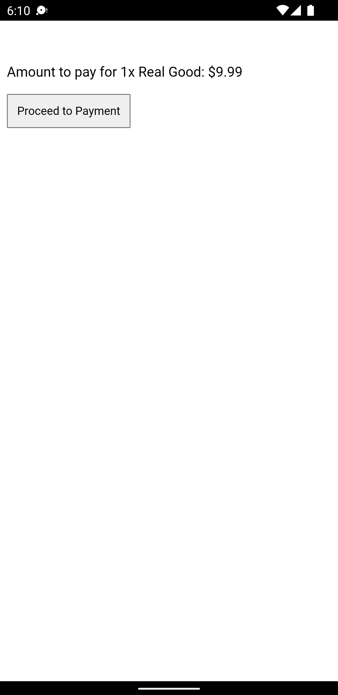
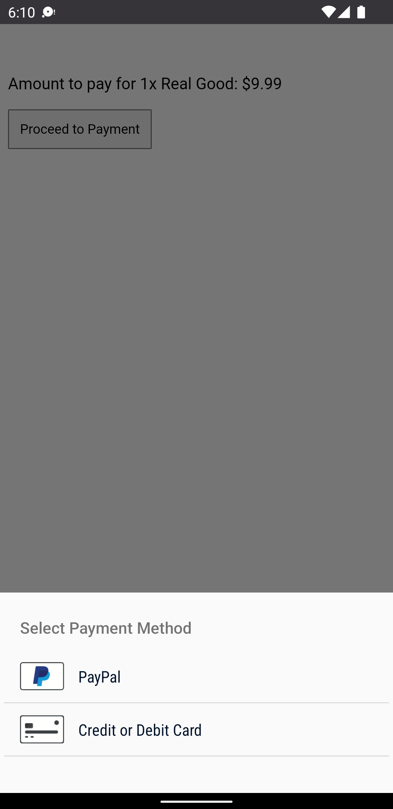
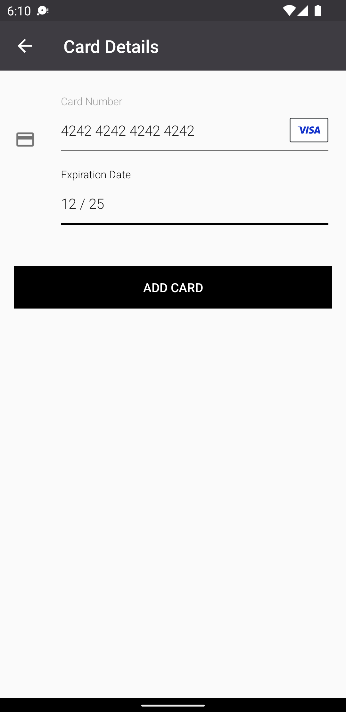

# Payment Request with Braintree

This guide uses the plugin at version 13 or later (which is in beta at this stage).

We will proceed in steps: setup, initialization and payment.

First we'll details the basic setup steps, of course you can skip the first few steps if you already have a working application you want to integrate the code into.

1. Install NodeJS and Cordova
2. Setup your Cordova project
3. Prepare an Account on Braintree
4. Install the In-App Purchases plugin and Braintree extension
5. Configure Braintree on [iaptic](https://www.iaptic.com/)

Once we have a Cordova application with Braintree support enabled and everything is in place on Braintree and Iaptic dashboards, we will move to coding a minimal demo app.

1. Initialize the in-app purchase plugin
2. Launch a payment request
3. Handle the purchase events
4. Finalize

## Setup

### 1. Install Dependencies

Needless to say, make sure you have the tools installed on your machine. During the writing of this guide, I've been using the following environment:

* **NodeJS** v10.12.0
* **Cordova** v8.1.2
* **macOS** 10.14.1

I'm not saying it won't work with different version. If you start fresh, it might be a good idea to use an up-to-date environment.

### 2. Create a Sandbox Braintree Account

Follow the instructions from Braintree to create a sandbox account. https://www.braintreepayments.com/sandbox

Markdown your API Credentials: Merchant ID, Public Key and Private Key.

### 3. Setup your Account on Iaptic

The Braintree implementation requires a server component that interacts with Braintree to create and settle transactions. Server side integration with the Braintree platform is outside the scope for this tutorial. We'll use [Iaptic](https://www.iaptic.com/)'s own integration that provides a simple platform neutral interface.

Go to [iaptic.com](https://www.iaptic.com/) to create an account (or login if you already have one). Fill in the Braintree section in iaptic's settings.

Also mark down your iaptic's **App Name** and **Public Key**.

### 4. Install the Braintree extension

Support for Braintree is added by installing an additional plugin with ID `cordova-plugin-purchase-braintree`.

For the most up-to-date information on how to install and setup the plugin, you can head to the [plugin's GitHub page](https://github.com/j3k0/cordova-plugin-purchase-braintree).

Let's install it:

```
cordova plugin add cordova-plugin-purchase-braintree
```

For this guide, I'll use an android device. As mentioned in the plugin's documentation, we have to add this section to our application's `config.xml`.

```xml
<platform name="android">
    <preference name="android-minSdkVersion" value="21" />
</platform>
```

## Code

### Base framework

#### index.html

Assuming you're starting from a blank project, we'll add the minimal amount of HTML for the purpose of this tutorial. Let's replace the `<body>` from the `www/index.html` file with the below.

```markup
<body>
  <div id="app"></div>
  <script type="text/javascript" src="cordova.js"></script>
  <script type="text/javascript" src="js/index.js"></script>
</body>
```

Let's also make sure to comment out Cordova template project's CSS.

You also need to enable the `'unsafe-inline'` `Content-Security-Policy` by adding it to the `default-src` section:

```markup
<meta http-equiv="Content-Security-Policy"
      content="default-src 'self' 'unsafe-inline' [...]" />
```

You can download the [full index.html file here](https://gist.github.com/j3k0/80c69837e5bacf83c4fc2320ba2e5dc2).

#### javascript

We will now create a new JavaScript file and load it from the HTML. The code below will initialize the plugin.

```javascript
document.addEventListener('deviceready', onDeviceReady);

function onDeviceReady() {

  if (!window.CdvPurchase) {
      console.log('CdvPurchase is not available');
      return;
  }
  const {store} = CdvPurchase;

  store.error(function(error) {
      console.log('ERROR ' + error.code + ': ' + error.message);
  });

  store.ready(function() {
    console.log("CdvPurchase is ready");
  });
 
  initializeStore();
  refreshUI();
}

function initializeStore() {
  // We will implement this soon
}

function refreshUI() {
  // Soon...
}
```

Here's a little explanation:

**Line 1**, it's important to wait for the "deviceready" event before using cordova plugins.

**Lines 5-8**, we check if the plugin was correctly loaded.

**Lines 11-13**, we setup an error handler. It just logs errors to the console.

> Whatever your setup is, you should make sure this runs as soon as the javascript application starts. You have to be ready to handle IAP events as soon as possible.

### Initialization

As mentioned earlier, we'll use iaptic for the server side integration with Braintree.

We'll instantiate the [iaptic component](https://github.com/j3k0/cordova-plugin-purchase/blob/v13/api/classes/CdvPurchase.Iaptic.md), using the provided `braintreeClientTokenProvider` and `validator` to

```javascript
function initializeStore() {
  const {store, Platform, Iaptic} = CdvPurchase;

  // create the link with Iaptic
  const iaptic = new Iaptic({
    apiKey: 'ffff0000ffff0000ffff0000',
    appName: 'my.app',
  });
  store.validator = iaptic.validator;

  // purchase events handlers
  store.when()
    .approved(transaction => transaction.verify())
    .verified(receipt => receipt.finish());

  // initialize the plugin with Braintree support
  store.initialize([{
      platform: Platform.BRAINTREE,
      options: {
        clientTokenProvider: iaptic.braintreeClientTokenProvider,
      }
  }]);
}
```

We add the standard purchase events handlers for when the transaction is `approved` and the receipt `verified`, with the [`store.when()`](https://github.com/j3k0/cordova-plugin-purchase/blob/v13/api/classes/CdvPurchase.Store.md#when) block.

In our call to [`store.initialize()`](https://github.com/j3k0/cordova-plugin-purchase/blob/v13/api/classes/CdvPurchase.Store.md#initialize), we add in the Braintree platform with its configuration.

In particular, it requires a [Client Token](https://developer.paypal.com/braintree/docs/guides/authorization/client-token) provider. For this example, we'll use the implementation provided by iaptic.

### User interface

You are responsible for creating a user interface that presents the detail concerning the upcoming payment. Let's create a very simple interface.

```javascript
let appState = 'BASKET';
let appMessage = '';

function refreshUI() {
  const el = document.getElementById('app');
  if (!el) return;
  if (appState === 'BASKET') {
    el.innerHTML = `
      <p>${appMessage}</p>
      <p>Amount to pay for 1x Real Good: $9.99</p>
      <div><button onclick="pay()">Proceed to Payment</button></div>
    `;
  }
  else if (appState === 'PAYMENT_INITIATED') {
    el.innerHTML = `<p>Select your payment method...</p>`;
  }
  else if (appState === 'PAYMENT_APPROVED') {
    el.innerHTML = `<p>Verifying your payment...</p>`;
  }
  else if (appState === 'PAYMENT_FINISHED') {
    el.innerHTML = `<p>Payment successful!</p>`;
  }
}
```

This is a primitive state machine that displays the basket, then the progress of the payment flow. While in the basket, the "Proceed to Payment" button calls the `pay()` function.

Let's implement that function.

### Payment request

```javascript
function pay() {
  const {store, Platform, ErrorCode} = CdvPurchase;

  // Showing some feedback in the UI (cf refreshUI)
  function setAppState(state, message) {
    appState = state;
    appMessage = message || '';
    refreshUI();
  }

  setAppState('IN_PROGRESS', 'Please wait...');
  store.requestPayment({

    // required fields
    platform: Platform.BRAINTREE,
    amountMicros: 9.99 * 1000000,
    currency: 'USD',
    productIds: ['REAL_GOOD'],

    // optional fields
    billingAddress: {
      givenName: 'John',
      surname: 'Doe',
      streetAddress1: '1200 3rd Ave',
      locality: 'Seattle',
      region: 'WA',
      postalCode: '98101',
      countryCode: 'US',
    },
    description: '1x Real Good',
    email: 'johndoe@gmail.com',
  })
  .cancelled(() => setAppState('BASKET'))
  .failed(error => setAppState('BASKET', 'Payment failed: ' + error.message))
  .initiated(() => setAppState('PAYMENT_INITIATED'))
  .approved(() => setAppState('PAYMENT_APPROVED'))
  .finished(() => setAppState('PAYMENT_FINISHED'));
}
```

Let's build and test that!

## Build and Test

The code above will work on both iOS and Android. We need to pick a test platform, so let's use Android.

We can build and run our app with:

```
npx cordova run android
```

You can then make a test payment using one of Braintree's test credit card numbers, like 4242424242424242.

Here's the result:

    
