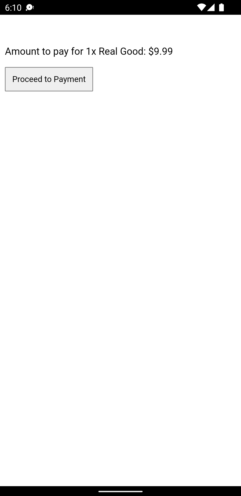
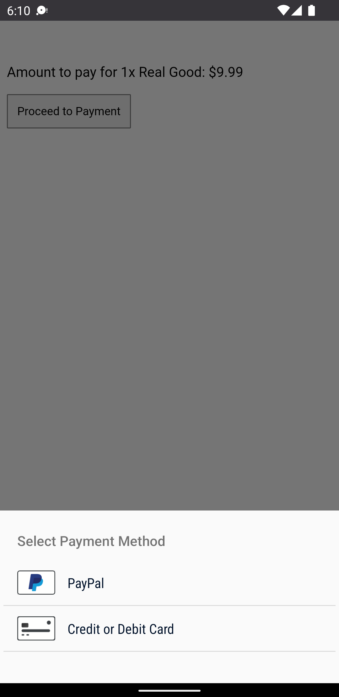
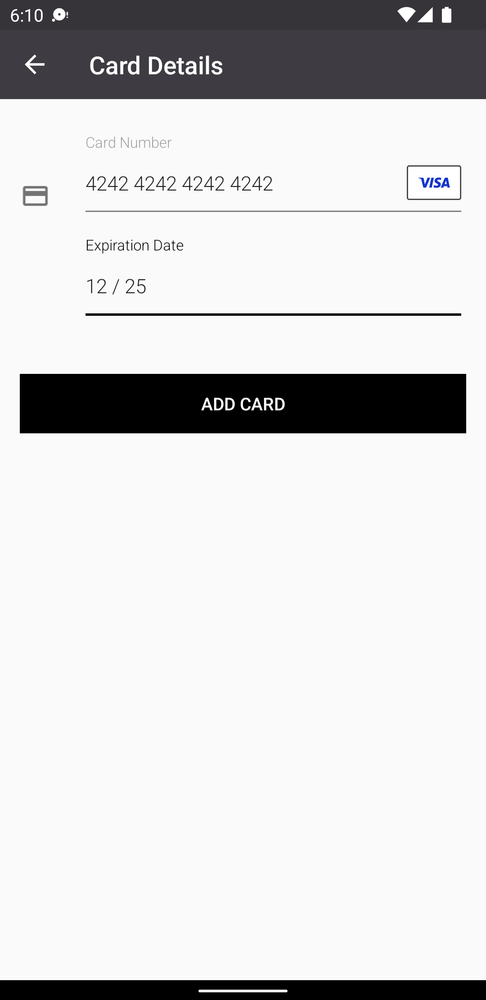

# Payment Request with Braintree

This use case explains how to request a custom payment (e.g., for physical goods, services, or dynamically priced items) using the Braintree platform via `cordova-plugin-purchase` v13+ and its **required Braintree extension** (`cordova-plugin-purchase-braintree`).

Unlike store products, payment requests typically involve a custom amount and require server-side processing of a payment method nonce generated by the Braintree SDK.

## 1. Platform Setup

First, ensure your Braintree account (Sandbox and Production), Cordova project, and native platforms (iOS/Android) are correctly configured.

## Setup for Braintree Payments

This guide details the necessary steps to configure your development environment, Braintree account, and application settings before implementing custom payments using the Braintree platform via `cordova-plugin-purchase` v13+ and its **required Braintree extension**.


**Platform Interfaces Change Frequently!**

The Braintree control panel interface, SDKs, and requirements change often. This guide provides a general overview but may become outdated.

**Always refer to the official Braintree documentation as the primary source:**
*   [Braintree Get Started](https://developer.paypal.com/braintree/docs/start/overview)
*   [Client SDK Setup (iOS)](https://developer.paypal.com/braintree/docs/guides/client-sdk/setup/ios/v6)
*   [Client SDK Setup (Android)](https://developer.paypal.com/braintree/docs/guides/client-sdk/setup/android/v6)
*   [Tokenization Keys & Client Tokens](https://developer.paypal.com/braintree/docs/guides/authorization/tokenization-key/javascript/v3/)
*   [Drop-in UI Guide](https://developer.paypal.com/braintree/docs/guides/drop-in/overview)


### 1. Braintree Account Setup

*   **Sandbox:** Sign up for a [Braintree Sandbox account](https://www.braintreepayments.com/sandbox) for development and testing. This provides test API keys and a simulated environment.
*   **Production:** When ready to accept real payments, apply for a [Braintree Production account](https://www.braintreepayments.com/signup) and complete the underwriting process.

### 2. Retrieve Braintree API Credentials

Log in to your Braintree Control Panel (Sandbox or Production):

*   Navigate to **Settings** (gear icon) -> **API**.
*   Note down your:
    *   **Merchant ID**
    *   **Public Key**
    *   **Private Key** (Keep this secure! It's used server-side).
*   You will also find your **Tokenization Key** here. This key can be used directly in the client-side SDK for basic authorization, primarily suitable for testing or simple integrations. **Using Client Tokens generated server-side is recommended for production.**

### 3. Install Dependencies

Install the core purchase plugin **AND** the Braintree extension plugin.

```bash
# Install the core plugin
cordova plugin add cordova-plugin-purchase

# Install the Braintree extension
cordova plugin add cordova-plugin-purchase-braintree
```

Also ensure you have base Cordova/Node development tools installed:

Needless to say, make sure you have the tools installed on your machine. During the writing of this guide, I've been using the following environment:

* **NodeJS** v10.12.0
* **Cordova** v8.1.2
* **macOS** 10.14.1

I'm not saying it won't work with different version. If you start fresh, it might be a good idea to use an up-to-date environment.


### 4. Create or Prepare Cordova Project

Set up your Cordova project and add the required platforms (iOS and/or Android).

*   **Create Project:**
    !INCLUDE "./create-cordova-project.md"
*   **Add Platforms:**
    ```bash
    cordova platform add ios
    cordova platform add android
    ```

### 5. Configure Android Project (Gradle/Dependencies)

The `cordova-plugin-purchase-braintree` extension uses Gradle to manage the native Braintree Android SDK dependencies.

*   Run `cordova prepare android`.
*   Ensure your project builds successfully (`cordova build android`). Gradle should automatically download the required Braintree libraries.
*   Check the plugin's `plugin.xml` for specific Android SDK version requirements if you encounter build issues related to dependencies.

### 6. Configure iOS Project (Cocoapods)

The Braintree extension uses Cocoapods for iOS dependencies.

*   **Install Cocoapods:** If you don't have it, run `sudo gem install cocoapods`.
*   **Navigate and Install:** After adding the iOS platform and the plugin, go to your project's `platforms/ios/` directory in the terminal and run:
    ```bash
    pod install --repo-update
    ```
*   **Open Workspace:** Always open the `.xcworkspace` file in Xcode, **not** the `.xcodeproj` file, after running `pod install`.
    ```bash
    open platforms/ios/*.xcworkspace
    ```
*   **Build:** Build the project in Xcode to ensure dependencies are linked correctly.

### 7. Initialize Braintree in Your App

In your application's JavaScript (after `deviceready`), you need to initialize the `CdvPurchase.store` including the Braintree platform adapter. This requires providing authorization.

**Option 1: Using Client Token Provider (Recommended for Production)**

This is the most secure method. Your server generates a short-lived Client Token using the Braintree Server SDK (with your Merchant ID, Public Key, and Private Key). Your app requests this token when needed.

```javascript
// In your initialization function (e.g., initializeStoreAndSetupListeners)
const { store, Platform, ErrorCode } = CdvPurchase;

const braintreeOptions = {
  clientTokenProvider: (callback) => {
    console.log('Requesting Braintree Client Token from server...');
    // Replace with your actual fetch call to your backend endpoint
    fetch('https://your-server.com/api/braintree/client-token', {
        method: 'POST',
        // Include authentication if needed: headers: { 'Authorization': 'Bearer ...' }
    })
    .then(response => response.ok ? response.json() : Promise.reject(new Error(`HTTP ${response.status}`)))
    .then(data => {
        if (data.clientToken) {
            console.log('Client Token received.');
            callback(data.clientToken); // Provide the token to the plugin
        } else {
            console.error('Server did not provide clientToken:', data);
            const err = { code: ErrorCode.COMMUNICATION, message: 'Failed to fetch Braintree client token from server.', isError: true, platform: Platform.BRAINTREE, productId: null };
            callback(err);
        }
    })
    .catch(error => {
        console.error('Error fetching Braintree client token:', error);
        const err = { code: ErrorCode.COMMUNICATION, message: 'Network error fetching Braintree client token: ' + error.message, isError: true, platform: Platform.BRAINTREE, productId: null };
        callback(err);
    });
  }
  // Add other options like googlePay, applePay, threeDSecure here if needed
};

store.initialize([{
  platform: Platform.BRAINTREE,
  options: braintreeOptions
}])
.then(/* ... */);
```
*   **Note:** You must implement the `/api/braintree/client-token` endpoint on your server using Braintree's server SDKs.

**Option 2: Using Tokenization Key (Simpler for Testing)**

Use your **Sandbox** Tokenization Key directly. **Do not** use this method with your Production Tokenization Key in a publicly distributed app, as it's less secure than Client Tokens.

```javascript
// In your initialization function
const { store, Platform } = CdvPurchase;

const braintreeOptions = {
  tokenizationKey: "YOUR_SANDBOX_TOKENIZATION_KEY" // Replace with your actual Sandbox key
  // Add other options like googlePay, applePay, threeDSecure here if needed
};

store.initialize([{
  platform: Platform.BRAINTREE,
  options: braintreeOptions
}])
.then(/* ... */);
```

### 8. (Optional) Configure Apple Pay (iOS Only)

To enable Apple Pay via Braintree:

1.  **Configure Apple Pay in Braintree:** Follow Braintree's guide to configure Apple Pay in your Braintree control panel (requires Apple Merchant ID setup).
2.  **Enable Apple Pay Capability:** In Xcode, under "Signing & Capabilities", add the "Apple Pay" capability and configure your Merchant ID.
3.  **Provide Options:** Add the `applePay` configuration within the `braintreeOptions` during `store.initialize`. At minimum, `companyName` is often needed.
    ```javascript
    const braintreeOptions = {
      clientTokenProvider: /* ... */,
      applePay: {
        companyName: 'Your Company Name',
        // Optional: Add paymentSummaryItems if needed, otherwise plugin uses PaymentRequest data
        // preparePaymentRequest: (paymentRequest) => { ... return customizedApplePayRequest; }
      }
    };
    ```

### 9. (Optional) Configure Google Pay (Android Only)

To enable Google Pay via Braintree:

1.  **Configure Google Pay in Braintree:** Follow Braintree's guide to enable Google Pay in your Braintree control panel (may require linking a Google Merchant ID).
2.  **Provide Options:** Add the `googlePay` configuration within the `braintreeOptions` during `store.initialize`.
    ```javascript
    const braintreeOptions = {
      clientTokenProvider: /* ... */,
      googlePay: {
        environment: 'TEST', // Or 'PRODUCTION'
        countryCode: 'US', // Your country code
        googleMerchantName: 'Your Company Name' // Optional: Displayed in Google Pay sheet
        // Optional: allowedPaymentMethods, etc.
      }
    };
    ```

### 10. (Optional) Configure 3D Secure

To add an extra layer of security for card payments:

1.  **Enable 3D Secure in Braintree:** Ensure 3D Secure is enabled for your Braintree account.
2.  **Provide Options:** Add the `threeDSecure` configuration within the `braintreeOptions`. You typically need to provide the amount and potentially billing/shipping details within the `store.requestPayment` call itself, but you can set defaults here.
    ```javascript
    const braintreeOptions = {
      clientTokenProvider: /* ... */,
      threeDSecure: {
        // amount is usually set dynamically in requestPayment
        // email, billingAddress can also be set in requestPayment
        versionRequested: CdvPurchase.Braintree.ThreeDSecure.Version.V2 // Request 3DS 2 if possible
        // exemptionRequested: true // If you want to request exemptions
      }
    };
    ```

---

After completing these steps, your Braintree account and application should be configured to process payments using the `cordova-plugin-purchase-braintree` extension and the `store.requestPayment()` method. Remember that the crucial step of processing the payment nonce **must happen on your server**.

## 2. Code Implementation

Implement the JavaScript code to initialize the Braintree adapter, display payment details, request the payment using `store.requestPayment()`, and handle the resulting events.

This section details the code implementation steps for processing a custom payment using the Braintree platform via `cordova-plugin-purchase` and its Braintree extension.

### 1. Base Framework

First, ensure you have the basic HTML structure and initial JavaScript setup as outlined in the [Code Framework section](code-framework.md). This includes waiting for `deviceready` and basic plugin checks.

#### index.html

Assuming you're starting from a blank Cordova project, let's set up the minimal HTML needed for the tutorials.

**Step 1: Modify `www/index.html`**

Replace the default `<body>` content with the following structure:

```html
<body>
  <div class="app">
    <h1>In-App Purchase Demo</h1>
    <!-- Area for status messages and errors -->
    <div id="messages" style="font-style: italic; color: #555; margin-bottom: 10px;">Loading...</div>
    <hr>
    <!-- Area to display product details -->
    <div id="product-details"></div>
    <hr>
    <!-- Area for other UI elements (like balance, feature status) -->
    <div id="user-status"></div>
     <hr>
    <!-- Area for management buttons -->
    <div id="management-buttons"></div>
  </div>

  <!-- Cordova script -->
  <script type="text/javascript" src="cordova.js"></script>
  <!-- Your application script -->
  <script type="text/javascript" src="js/index.js"></script>
</body>
```
*   **Explanation:** We create a main container (`#app`) and add specific `div` elements (`#messages`, `#product-details`, `#user-status`, `#management-buttons`) that subsequent code examples will use to display information dynamically.

**Step 2: Adjust Content Security Policy (CSP)**

In the `<head>` of your `www/index.html`, find the `<meta http-equiv="Content-Security-Policy" ...>` tag. You need to modify the `connect-src` directive to allow connections to your receipt validation server. Also, ensure `'unsafe-inline'` is present in `script-src` or `default-src` if your examples use inline `onclick` handlers (though using `addEventListener` in JavaScript is generally preferred).

```html
<meta http-equiv="Content-Security-Policy"
      content="default-src 'self' data: gap: https://ssl.gstatic.com 'unsafe-eval';
               style-src 'self' 'unsafe-inline';
               media-src *;
               img-src 'self' data: content:;
               connect-src 'self' https://your-validator-server.com;">
               <!-- Add other necessary sources -->
```
*   **Explanation:**
    *   Replace `https://your-validator-server.com` with the actual URL of your receipt validation service (e.g., `https://validator.iaptic.com`). If you don't use a validator initially, you might omit this, but you'll need it later for secure implementations.
    *   The example keeps other default Cordova CSP directives. Adjust them based on your app's needs.

**Step 3: (Optional) Clean Up Default CSS**

You might want to comment out or remove the default CSS (`www/css/index.css`) from the Cordova template project to avoid style conflicts with the simple examples.

#### JavaScript (`www/js/index.js`)

This section provides the minimal JavaScript foundation needed to start using the `cordova-plugin-purchase` plugin in your `www/js/index.js` file (or equivalent).


```javascript
// Wait for Cordova's deviceready event
document.addEventListener('deviceready', onDeviceReady, false);

function onDeviceReady() {
  console.log('Device is ready.');
  setStatus('Device ready.'); // Update UI status

  // --- Essential Plugin Check ---
  // Verify that the CdvPurchase namespace and store object are available.
  if (!window.CdvPurchase || !window.CdvPurchase.store) {
    const msg = 'CdvPurchase plugin is not available. Ensure it is installed and loaded correctly.';
    console.error(msg);
    setStatus('ERROR: ' + msg);
    // Stop further initialization if the plugin isn't found.
    return;
  }

  // --- Basic Setup (Before Initialization) ---
  const { store, LogLevel, ErrorCode } = CdvPurchase;
  console.log('CdvPurchase.store available. Version ' + store.version);

  // Set the desired verbosity level for the plugin's logger.
  // LogLevel.DEBUG provides the most detailed logs, useful for development.
  // Use LogLevel.INFO or LogLevel.WARNING for production.
  store.verbosity = LogLevel.DEBUG;

  // Register a global error handler for the store.
  // This catches general plugin errors (initialization, setup, etc.).
  // Purchase-specific errors are typically handled via promises/callbacks.
  store.error(error => {
    console.error('STORE ERROR: Code=' + error.code + ' Message=' + error.message);
    setStatus('ERROR: ' + error.message);
  });

  // --- Defer Specific Initialization ---
  // Call the main initialization function for your specific use case.
  // This function (defined elsewhere in your code or the tutorial)
  // will handle product registration, validator setup, event listeners,
  // and calling store.initialize().
  initializeStoreAndSetupListeners();

  // Initial UI refresh (might show loading states until products load)
  refreshUI();
}

// --- Helper Functions (Example) ---

// Function to update a status message element in the HTML
function setStatus(message) {
  console.log('[Status] ' + message);
  const statusEl = document.getElementById('messages'); // Assumes an element with id="messages" exists
  if (statusEl) {
    statusEl.textContent = message;
  }
}

// --- Placeholder Functions (to be implemented by specific use-case guides) ---

// This function will be implemented in specific guides to register products,
// set the validator, setup 'when' listeners, and call store.initialize().
function initializeStoreAndSetupListeners() {
  console.log('Placeholder: initializeStoreAndSetupListeners() called.');
  // Example structure (implement in specific guides):
  // const { store, Platform, ProductType } = CdvPurchase;
  // store.register([...]);
  // store.validator = '...';
  // store.when()...
  // store.initialize([...]).then(...);
  setStatus('Store setup needs implementation.');
}

// This function will be implemented in specific guides to update the UI
// based on product data, ownership status, etc.
function refreshUI() {
  console.log('Placeholder: refreshUI() called.');
  // Example structure (implement in specific guides):
  // const product = CdvPurchase.store.get(...);
  // Update HTML elements based on product.title, product.pricing, product.owned, etc.
}

// Make purchase function global if called directly from HTML onclick
// window.myPurchaseFunction = function() { ... }

```


**Explanation:**

1.  **Wait for `deviceready` (Line 2):** Essential first step for any Cordova plugin interaction.
2.  **Plugin Check (Lines 8-14):** Verifies that `CdvPurchase.store` is available before proceeding.
3.  **Basic Setup (Lines 17-29):**
    *   Aliases common plugin members (`store`, `LogLevel`, etc.) for convenience.
    *   Sets `store.verbosity` to `DEBUG` for detailed logging during development.
    *   Sets up a global `store.error` handler to catch and log general plugin errors.
4.  **Deferred Initialization (Line 35):** Calls `initializeStoreAndSetupListeners()`. This function is intentionally left as a placeholder here. Specific use-case guides (like setting up subscriptions or consumables) will provide the implementation for this function, which will include `store.register()`, `store.validator = ...`, `store.when()...`, and `store.initialize()`.
5.  **Initial UI Refresh (Line 38):** Calls `refreshUI()`, another placeholder function that specific guides will implement to display product information and purchase status.
6.  **Helper Functions (Lines 43-51):** Includes a basic `setStatus` function as an example for updating the UI.
7.  **Placeholders (Lines 54-72):** Empty definitions for `initializeStoreAndSetupListeners` and `refreshUI`, their specific logic depends on the use case and will be provided in subsequent steps of the tutorials.

This minimal base ensures the plugin is loaded and basic logging/error handling is in place before diving into platform-specific or product-type-specific configurations in the main use-case guides.

### 2. Initialization (`initializeStoreAndSetupListeners`)

Next, implement the `initializeStoreAndSetupListeners` function. This involves:
*   Configuring Braintree options, crucially providing a `clientTokenProvider` (recommended) or a `tokenizationKey` (for testing).
*   Setting up the **mandatory** `store.validator`. Your validator endpoint *must* be capable of receiving a Braintree payment method nonce and using the Braintree Server SDK to create a `transaction.sale`.
*   Setting up `store.when()` listeners to handle the `approved` (nonce received), `verified` (server processed nonce successfully), and `finished` (acknowledged) states.
*   Calling `store.initialize()` with the Braintree platform and options.


```javascript
// This function should be called by onDeviceReady after basic setup
function initializeStoreAndSetupListeners() {
  console.log('Setting up store for Braintree...');
  setStatus('Initializing Braintree...');

  // Ensure CdvPurchase and its members are available
  if (!window.CdvPurchase) {
    console.error('CdvPurchase is not defined.');
    setStatus('Error: Payment plugin not loaded.');
    return;
  }
  const { store, Platform, ErrorCode, LogLevel, Iaptic } = CdvPurchase;

  // --- Configuration ---
  // Replace with your actual Iaptic App Name and Public API Key (if using Iaptic)
  const IAPTIC_APP_NAME = 'YOUR_IAPTIC_APP_NAME';
  const IAPTIC_API_KEY = 'YOUR_IAPTIC_PUBLIC_KEY';
  // URL to your backend endpoint that generates Braintree Client Tokens
  const BRAINTREE_CLIENT_TOKEN_URL = 'https://your-server.com/api/braintree/client-token'; // Replace
  // URL to your backend endpoint that processes Braintree nonces
  const BRAINTREE_VALIDATOR_URL = 'https://your-server.com/api/braintree/validate'; // Replace

  // --- Optional: Iaptic Setup (Helper for token generation and validation) ---
  // const iaptic = new Iaptic({ apiKey: IAPTIC_API_KEY, appName: IAPTIC_APP_NAME });

  // --- Braintree Options ---
  const braintreeOptions = {
    // Option 1: Client Token Provider (Recommended)
    clientTokenProvider: (callback) => {
      console.log('Requesting Braintree Client Token from server...');
      setStatus('Requesting client token...');
      // Replace with your actual fetch call to your server endpoint
      fetch(BRAINTREE_CLIENT_TOKEN_URL, { method: 'POST' /* Add auth headers if needed */ })
        .then(response => {
          if (!response.ok) throw new Error(`HTTP error! status: ${response.status}`);
          return response.json();
        })
        .then(data => {
          if (data.clientToken) {
            console.log('Client Token received.');
            callback(data.clientToken); // Success
          } else {
            console.error('Server did not provide clientToken:', data);
            const err = { code: ErrorCode.COMMUNICATION, message: 'Failed to fetch Braintree client token from server.', isError: true, platform: Platform.BRAINTREE, productId: null };
            callback(err);
            setStatus('Error: Could not get client token.');
          }
        })
        .catch(error => {
          console.error('Error fetching Braintree client token:', error);
          const err = { code: ErrorCode.COMMUNICATION, message: 'Network error fetching Braintree client token: ' + error.message, isError: true, platform: Platform.BRAINTREE, productId: null };
          callback(err);
          setStatus('Error: Network error getting client token.');
        });
    },

    // Option 2: Tokenization Key (Simpler for testing, less secure for production)
    // tokenizationKey: 'YOUR_SANDBOX_TOKENIZATION_KEY', // Replace if using this method

    // Optional configurations (uncomment and configure as needed)
    // applePay: { companyName: 'My Awesome Company' },
    // googlePay: { countryCode: 'US', googleMerchantName: 'My Awesome Company', environment: 'TEST' },
    // threeDSecure: { exemptionRequested: true }
  };

  // --- Setup Receipt Validator (MANDATORY for Braintree) ---
  // Your validator MUST process the payment nonce received from Braintree.
  // It needs to call the Braintree server SDK's transaction.sale() method.
  store.validator = BRAINTREE_VALIDATOR_URL; // Replace with your endpoint
  // store.validator = iaptic.validator; // Or use Iaptic's validator

  // --- Setup Event Handlers ---
  store.when()
    .approved(transaction => {
      // Nonce received from Braintree SDK (stored in transaction.transactionId)
      console.log(`Payment approved by Braintree SDK (Nonce: ${transaction.transactionId}). Verifying...`);
      setStatus('Payment approved. Verifying with server...');
      // Send the nonce to your server for processing via the validator.
      transaction.verify();
    })
    .verified(receipt => {
      // This means your validator successfully processed the nonce
      // with the Braintree gateway (e.g., created a transaction sale).
      console.log('Braintree payment verified and processed server-side.');
      setStatus('Payment Successful!');
      // Now acknowledge the transaction with the plugin
      receipt.finish();
      // Fulfill the order (grant access, ship item, etc.)
      // Update UI state (e.g., show success message)
      setAppState('PAYMENT_FINISHED', 'Payment Successful!');
    })
    .unverified(unverified => {
        console.error('Payment verification failed:', unverified.payload);
        setStatus(`Verification Failed: ${unverified.payload.message}`);
        setAppState('BASKET', `Verification Failed: ${unverified.payload.message}`);
    })
    .finished(transaction => {
      console.log(`Braintree transaction finished: ${transaction.transactionId}`);
      // Final cleanup if needed
    })
    .cancelled(transaction => {
        // Note: Braintree flow cancellation is handled by the requestPayment promise .cancelled()
        console.log('Transaction cancelled (might be from DropIn UI):', transaction.transactionId);
        setStatus('Payment cancelled.');
        setAppState('BASKET', 'Payment cancelled.');
    });
    // No need for productUpdated/receiptUpdated unless mixing with store products

  // --- Initialize the Plugin ---
  console.log('Initializing store with Braintree platform...');
  store.initialize([{
      platform: Platform.BRAINTREE,
      options: braintreeOptions
  }])
  .then((errors) => {
      if (errors && errors.length > 0) {
          console.error('Braintree initialization failed:', errors[0]);
          setStatus(`Error initializing Braintree: ${errors[0].message}`);
          setAppState('BASKET', 'Error initializing payment.');
      } else {
          console.log('Braintree platform initialized.');
          setStatus('Ready to pay.');
          setAppState('BASKET', 'Ready to pay.'); // Update UI state
      }
  });
}

// Ensure setStatus and setAppState are defined (should be in initial script or refreshUI script)
if (typeof setStatus !== 'function') { setStatus = (message) => console.log('[Status] ' + message); }
if (typeof setAppState !== 'function') { setAppState = (state, message) => { console.log(`[State] 
{message}`); refreshUI(); }; } // Link to refreshUI

```


**Explanation:**
*   **Lines 11-15:** Define configuration constants (replace placeholders!).
*   **Lines 21-25:** (Optional) Instantiate Iaptic helper if using it for token/validation.
*   **Lines 28-60:** Define `braintreeOptions`. The `clientTokenProvider` (Lines 30-57) is the recommended way to authorize the client SDK. It fetches a short-lived token from your server. Alternatively, uncomment and use `tokenizationKey` (Line 59) for sandbox testing. Optional Apple Pay/Google Pay/3DS settings can be added here.
*   **Lines 63-66:** **Crucially**, set `store.validator` to your backend endpoint that processes Braintree nonces. Without this, payments cannot be completed.
*   **Lines 69-91:** Set up `store.when()` listeners.
    *   `.approved()`: Triggered when the Braintree SDK successfully generates a nonce. **You must call `transaction.verify()` here** to send the nonce to your validator.
    *   `.verified()`: Triggered after your validator successfully processes the nonce (calls Braintree's `transaction.sale`) and returns a success response. Call `receipt.finish()` here and fulfill the order.
    *   `.unverified()`: Handles validation failures reported by your server.
    *   `.finished()`: Confirms the transaction is fully acknowledged by the plugin.
    *   `.cancelled()`: Handles cancellations from the Drop-in UI (though the `requestPayment` promise `.cancelled()` is often more direct).
*   **Lines 94-110:** Call `store.initialize()` to activate the Braintree adapter. Update UI state based on success or failure.

### 3. User Interface (`refreshUI`)

Implement the `refreshUI` function to display the payment details and update the UI based on the payment state (`LOADING`, `BASKET`, `IN_PROGRESS`, `PAYMENT_INITIATED`, `PAYMENT_APPROVED`, `PAYMENT_FINISHED`).


```javascript
// Global state variables (consider a more robust state management approach for larger apps)
let appState = 'LOADING'; // Initial state: LOADING, BASKET, IN_PROGRESS, PAYMENT_INITIATED, PAYMENT_APPROVED, PAYMENT_FINISHED
let appMessage = 'Initializing Payment...';

// Function to update the application's UI based on the current state
function refreshUI() {
  const appEl = document.getElementById('app'); // Main container element
  const messagesEl = document.getElementById('messages'); // Element for status messages
  const paymentSectionEl = document.getElementById('payment-section'); // Payment specific section
  const payButtonEl = document.getElementById('pay-button'); // The pay button

  if (!appEl || !messagesEl || !paymentSectionEl || !payButtonEl) {
    console.error('Required UI elements not found in index.html for refreshUI!');
    // Attempt to create elements if missing (basic fallback for snippets)
    if (!messagesEl && appEl) appEl.insertAdjacentHTML('afterbegin', '<div id="messages"></div>');
    if (!paymentSectionEl && appEl) appEl.insertAdjacentHTML('beforeend', '<div id="payment-section"><button id="pay-button">Pay</button></div>');
    // Re-query after potential creation
    messagesEl = document.getElementById('messages');
    paymentSectionEl = document.getElementById('payment-section');
    payButtonEl = document.getElementById('pay-button');
    if (!messagesEl || !paymentSectionEl || !payButtonEl) return; // Still missing, give up
  }


  console.log(`Refreshing UI - State: 
{appMessage}`);

  // Update status message display
  messagesEl.textContent = appMessage;
  messagesEl.style.color = appState.startsWith('Error') || appState.includes('Failed') ? 'red' : '#555';

  // Show/hide/update elements based on state
  switch (appState) {
    case 'LOADING':
      paymentSectionEl.style.display = 'none'; // Hide payment section while loading
      payButtonEl.disabled = true;
      payButtonEl.textContent = 'Loading...';
      break;

    case 'BASKET':
      paymentSectionEl.style.display = 'block'; // Show payment section
      payButtonEl.disabled = false; // Enable pay button
      payButtonEl.textContent = 'Pay Now';
      break;

    case 'IN_PROGRESS': // General processing state
    case 'PAYMENT_INITIATED': // Drop-in UI shown
    case 'PAYMENT_APPROVED': // Nonce received, verifying server-side
      paymentSectionEl.style.display = 'block';
      payButtonEl.disabled = true; // Disable button during processing
      payButtonEl.textContent = 'Processing...';
      break;

    case 'PAYMENT_FINISHED':
      paymentSectionEl.style.display = 'block';
      payButtonEl.disabled = true; // Payment complete, disable button
      payButtonEl.textContent = 'Payment Complete!';
      // Optionally hide the payment section or show a different success message
      // paymentSectionEl.innerHTML = '<p>Thank you for your purchase!</p>';
      break;

    default: // Includes error states if message indicates error
      paymentSectionEl.style.display = 'block';
      payButtonEl.disabled = true; // Keep disabled on error until resolved
      payButtonEl.textContent = 'Pay Now';
      break;
  }
}

// Helper function to update state and trigger UI refresh
function setAppState(newState, message) {
  console.log(`Setting state from ${appState} to ${newState}`);
  appState = newState;
  appMessage = message || ''; // Use provided message or clear it
  refreshUI(); // Update the UI immediately after state change
}

// Initial UI state setup on load
document.addEventListener('deviceready', () => {
    // Set initial state before store initialization might finish
    setAppState('LOADING', 'Initializing Payment...');
}, false);

// Ensure refreshUI is called initially if needed elsewhere
// refreshUI(); // Call if needed outside of setAppState
```


**Explanation:**
*   This function manages showing/hiding elements and enabling/disabling the "Pay Now" button based on the `appState` variable.
*   The `setAppState` helper updates the state and calls `refreshUI`.

### 4. Payment Request (`requestBraintreePayment`)

Implement the function triggered by your "Pay Now" button. This function uses `store.requestPayment()` to initiate the Braintree flow.


```javascript
// Make this function globally accessible if called from HTML onclick
window.requestBraintreePayment = function() {
  // Ensure CdvPurchase and its members are available
  if (!window.CdvPurchase || !window.CdvPurchase.store) {
    console.error('CdvPurchase is not defined.');
    setAppState('BASKET', 'Error: Payment plugin not loaded.');
    return;
  }
  const { store, Platform, ErrorCode } = CdvPurchase;

  // --- Payment Details (Example) ---
  const GADGET_ID = 'awesome_gadget_01';
  const GADGET_TITLE = 'Awesome Gadget';
  const GADGET_PRICE_MICROS = 19990000; // $19.99
  const CURRENCY = 'USD';

  // --- Optional User/Billing Info ---
  const billingInfo = {
    givenName: 'John',
    surname: 'Doe',
    streetAddress1: '123 Braintree St',
    locality: 'Chicago',
    region: 'IL', // State/Province code
    postalCode: '60654',
    countryCode: 'US', // 2-letter ISO code
    // phoneNumber: '15551234567', // Optional
  };
  const userEmail = 'john.doe@example.com'; // Optional

  // --- Update UI ---
  setAppState('IN_PROGRESS', 'Initiating payment...'); // Update UI state

  // --- Create and Execute Payment Request ---
  store.requestPayment({
    // Required fields
    platform: Platform.BRAINTREE,
    items: [{
      id: GADGET_ID,
      title: GADGET_TITLE,
      pricing: {
        priceMicros: GADGET_PRICE_MICROS,
        // Currency can be inferred from top level if items don't specify
      }
    }],
    amountMicros: GADGET_PRICE_MICROS, // Total amount for the request
    currency: CURRENCY,

    // Optional fields
    description: `Payment for ${GADGET_TITLE}`, // Shown in some payment flows
    billingAddress: billingInfo,
    email: userEmail,

  } /*, additionalData can go here if needed */)
  .cancelled(() => {
    console.log('User cancelled Braintree payment flow.');
    setAppState('BASKET', 'Payment cancelled.');
  })
  .failed(error => {
    console.error('Braintree payment request failed:', error);
    setAppState('BASKET', `Payment failed: ${error.message}`);
  })
  .initiated(transaction => {
    // Braintree Drop-In UI is likely presented now, or payment flow started.
    console.log(`Transaction initiated (UI shown?): ${transaction.transactionId}`);
    setAppState('PAYMENT_INITIATED', 'Please complete payment...');
  })
  .approved(transaction => {
    // Nonce received from Braintree SDK, needs server processing.
    // The 'initializeStoreAndSetupListeners' function should have registered
    // a store.when().approved() listener that calls transaction.verify().
    // This promise chain primarily handles UI flow and initiation errors.
    console.log(`Payment approved by Braintree SDK (Nonce: ${transaction.transactionId}). Verification should be in progress...`);
    setAppState('PAYMENT_APPROVED', 'Payment approved. Verifying with server...');
  })
  .finished(transaction => {
    // This is called AFTER successful verification AND finish() in the event listener.
    // The UI state should already be 'PAYMENT_FINISHED' set by the .verified listener.
    console.log(`Payment finished and acknowledged (from promise): ${transaction.transactionId}`);
  });
}

// Ensure setAppState is defined globally or accessible
if (typeof setAppState !== 'function') { setAppState = (state, message) => { console.log(`[State] 
{message}`); refreshUI(); }; }
```


**Explanation:**
*   **Lines 10-29:** Define payment details (items, total amount, currency) and optional billing/user info.
*   **Line 32:** Update UI state to show processing.
*   **Lines 35-54:** Call `store.requestPayment()` with `platform: Platform.BRAINTREE` and the payment details.
*   **Lines 55-end:** Chain promise handlers to manage the UI state during the payment flow:
    *   `.cancelled()`: User closed the Drop-in UI.
    *   `.failed()`: An error occurred *initiating* the payment request.
    *   `.initiated()`: The Braintree Drop-in UI has likely been presented.
    *   `.approved()`: The Braintree SDK returned a nonce; verification is now happening via the `store.when().approved()` listener setup earlier.
    *   `.finished()`: Called after the entire flow (including verification and `finish()`) is complete.

With these pieces in place, your app can initialize Braintree, display payment options, request a payment, and handle the nonce processing via your backend validator.

## 3. Server-Side Nonce Processing (Mandatory)

The client-side flow only generates a **payment method nonce**. This nonce is temporary and represents the user's authorized payment method (e.g., card details, PayPal account).

*   **Your backend server MUST receive this nonce** (typically sent from the `.approved()` event via your `store.validator` endpoint).
*   Your server then uses the **Braintree Server SDK** (Node.js, PHP, Python, etc.) along with your **Braintree Private Key** to call the Braintree API (e.g., `gateway.transaction.sale()`) with the nonce and the payment amount.
*   This server-side call creates the actual charge on the payment method.
*   Your `store.validator` should return a success response only after the Braintree transaction is successfully created.

**Never trust the client-side `approved` event alone to fulfill an order.**

## 4. Server-to-Server Webhooks (Recommended)

For robust fulfillment, especially for asynchronous payment methods or post-settlement events, configure webhooks in your Braintree control panel to notify your server about transaction status changes (e.g., settlement confirmation, disputes).

When using a validation service like Iaptic to process the Braintree payment nonce, the service typically handles the communication with the Braintree gateway (e.g., calling `transaction.sale`). After a successful transaction on Braintree's side, Iaptic (or your custom validator) will notify *your* application backend via a server-to-server webhook.

This webhook informs your server that a specific payment (often linked to your internal user ID if provided during validation) has been successfully completed. Your server should then:

1.  Verify the webhook's authenticity (e.g., check a secret signature provided by Iaptic).
2.  Update the user's account status in your database (e.g., mark order as paid, grant access, credit virtual currency).
3.  Respond to the webhook request with a success status (e.g., HTTP 200 OK) so the service knows it was received.

Here's an **example** structure of what a webhook payload *might* look like (actual format depends on your validator service):

```js
{
  "type": "purchases.updated",
  "applicationUsername": "my_username",
  "purchases": {
    "REAL_GOOD": {
      "platform": "braintree",
      "purchaseId": "braintree:xxxxxxxx",
      "transactionId": "braintree:xxxxxxxx",
      "productId": "REAL_GOOD",
      "purchaseDate": "2022-11-14T10:57:48.000Z",
      "currency": "EUR",
      "amountMicros": 9990000,
      "sandbox": true,
      "isPending": false,
      "amountUSD": 9.77,
      "raw": { /* ... */ }
    }
  },
  "password": "xxxxxxxx-xxxx-xxxx-xxxx-xxxxxxxxxxxx"
}
```

Handling this webhook correctly on your server is crucial for reliable order fulfillment after a Braintree payment processed via a validator. Consult your chosen validation service's documentation for specific details on their webhook format and security recommendations.*(Note: This section uses Iaptic as an example validator service; adapt if using your own backend).*

## 5. Testing

Follow the specific testing procedures using your Braintree Sandbox account and Braintree's test card numbers.

After implementing the code from the previous sections, you can test the Braintree payment flow.

**Prerequisites:**

1.  **Braintree Sandbox Account:** Ensure you have set up a Braintree Sandbox account.
2.  **Client Token/Tokenization Key:** Your app must be initialized with a valid **Sandbox** Client Token or Tokenization Key. Using production keys will result in real charges or errors.
3.  **Validator Endpoint (Mock or Real):** You need a backend endpoint configured as `store.validator` that can receive the payment nonce from the `.approved()` step. For initial testing, this endpoint could simply log the received nonce and return a successful validation response to allow the `.verified()` and `.finished()` steps to proceed in the app. **Do not fulfill orders based on this mock validation.** Later, implement the actual Braintree `transaction.sale` call on your server.
4.  **Platform Setup:** Build and run the app on a device or emulator (Android or iOS).

**Testing Steps:**

1.  **Launch App:** Start your application. Check the console logs to ensure the Braintree platform initializes successfully and the UI reaches the 'Ready to pay' state.
2.  **Initiate Payment:** Tap the "Pay Now" button in your app.
3.  **Braintree Drop-in UI:** The Braintree Drop-in UI should appear, presenting payment options.
    *   
4.  **Enter Test Card Details:** Select the "Card" option (or another if configured). Use one of Braintree's official test card numbers. A common one for success is:
    *   **Card Number:** `4111 1111 1111 1111`
    *   **Expiry Date:** Any date in the future (e.g., 12/2025)
    *   **CVV:** Any 3 digits (e.g., 123)
    *   **Postal Code:** Any 5 digits (e.g., 12345)
    *   
5.  **Confirm Payment:** Tap the button to submit the payment (e.g., "Pay $XX.XX").
    *   
6.  **Observe App & Logs:**
    *   The Drop-in UI should close.
    *   Your app's status message should update (e.g., "Payment approved. Verifying with server...").
    *   Check console logs for the `approved` event, which includes the payment method nonce (`transaction.transactionId`).
    *   Your validator endpoint should receive a request containing this nonce.
    *   **(If Validator Mocked/Successful):** Your validator returns success. The app logs the `verified` event, calls `receipt.finish()`, logs the `finished` event, and updates the UI to "Payment Successful!".
    *    
7.  **Verify Server (Real Validator):** If using a real validator, check your Braintree Sandbox control panel to confirm that a transaction corresponding to the nonce was successfully created (e.g., status "Submitted for Settlement"). Check your server logs to ensure fulfillment logic was triggered.

**Testing Failures:**

*   Use Braintree's specific test card numbers designed to trigger processor declines (e.g., `4242...` often works, check Braintree docs for current decline cards).
*   Test cancelling the Drop-in UI (should trigger the `.cancelled()` callback in `requestPayment`).
*   Simulate failures in your validator endpoint to test the `.unverified()` handler.

This process allows you to verify the client-side flow and the crucial interaction with your backend for processing the payment nonce.
