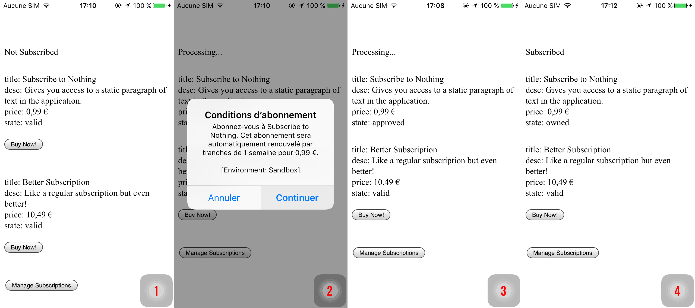

# Paid Subscription for iOS & macOS


# Subscription on iOS

In this guide, we will build a small application with a subscription that works on iOS.

On iOS, the plugin supports simple subscriptions and subscriptions groups. Introductory prices and promotional offers are supported yet.

Here's what we will build: a simple application to manage a subscription with 2 different levels (basic subscription, and better subscription).



Let's dig into this.

## Setup for iOS AppStore


**Platform Interfaces Change Frequently!**

The App Store Connect interface and Apple's requirements change often. This guide provides a general overview but may become outdated.

**Always refer to the official Apple documentation as the primary source:**
*   [App Store Connect Help](https://help.apple.com/app-store-connect/)
*   [In-App Purchase Configuration](https://developer.apple.com/help/app-store-connect/configure-in-app-purchase-settings/overview-for-configuring-in-app-purchases)


This section covers the essential steps for setting up your iOS/macOS app for In-App Purchases with the Cordova plugin.

### 1. Install Dependencies


Needless to say, make sure you have the tools installed on your machine. During the writing of this guide, I've been using the following environment:

* **NodeJS** v10.12.0
* **Cordova** v8.1.2
* **macOS** 10.14.1

I'm not saying it won't work with different version. If you start fresh, it might be a good idea to use an up-to-date environment.


### 2. Create Cordova Project

#### Create the project

If it isn't already created:

```text
$ cordova create CordovaProject cc.fovea.purchase.demo PurchaseNC
Creating a new cordova project.
```

For details about what those parameters are:

```text
$ cordova help create
```

Note, feel free to pick a different project ID and name. Remember whatever values you put in here.

Let's head into our cordova project's directory \(should match whatever we used in the previous step.

```text
$ cd CordovaProject
```
#### Add iOS platform

```text
$ cordova platform add ios
```


### 3. Setup AppStore Application & Agreements

*   **Apple Developer Account:** Ensure you have an active Apple Developer Program membership.
*   **App Record:** Create an App Record for your application in [App Store Connect](https://appstoreconnect.apple.com).
*   **Agreements, Tax, and Banking:** Ensure all agreements are accepted and banking/tax information is complete in the "Agreements, Tax, and Banking" section of App Store Connect. Your app won't be able to process purchases otherwise.
*   **Bundle ID:** Verify the Bundle ID in App Store Connect exactly matches the `id` in your `config.xml`.


First, I assume you have an Apple developer account. If not time to register, because it's mandatory.

Let's now head to the [AppStore Connect](https://appstoreconnect.apple.com) website. In order to start developing and testing In-App Purchases, you need all contracts in place as well as your financial information setup. Make sure there are no warning left there.

I'll not guide you through the whole procedure, just create setup your Apple application as usual.

#### Retrieve the Shared Secret

Since you are here, let's retrieve the Shared Secret. You can use an App-Specific one or a Master Shared Secret, at your convenience: both will work. Keep the value around, it'll be required, especially if you are implementing subscriptions.


### 4. Install and Prepare with XCode


When you only require iOS support, no need for special command line arguments:

```text
$ cordova plugin add cordova-plugin-purchase
```

You then have to activate the In-App Purchase capability manually for your application using Xcode. Unfortunately it's not something the plugin can do automatically. So let's first prepare the iOS project:

```text
$ cordova prepare ios
```

Then open the project on Xcode:

```text
$ open platforms/ios/*.xcodeproj
```

Get to the project's settings by clicking on the project's icon, which is the top-most item in the left-side pane tree view.

Select the target, go to _Capabilities_, scroll down to _In-App Purchase_ and make sure it's **"ON".**


Now try to **build the app from Xcode**. It might point you to a few stuff it might automatically fix for you if you're starting from a fresh project, like selecting a development team and creating the signing certificate. So just let Xcode do that for you except if you have a good reason not to and know what you're doing.

Successful build? You're good to go!


### 5. Create In-App Products

### 5. Create In-App Products

If you followed the [Setup AppStore Application](#3-setup-appstore-application) section, you should have everything setup. Head again to the App's In-App Purchases page: select your application, then _Features_, then _In-App Purchases_.

From there you can create your In-App Products. Select the appropriate type, fill in all required metadata and select _cleared for sale_.


Even if that sounds stupid, you need to fill-in ALL metadata in order to use the In-App Product in development, even the screenshot for reviewers. Make sure you have at least one localization in place too.


The process is well explained by Apple, so I'll not enter into more details.


### 6. Create Test Users

### 6. Create Test Users

In order to test your In-App Purchases during development, you should create some test users.

You can do so from the AppStore Connect website, in the _Users & Access_ section. There in the sidebar, you should see "Sandbox > Testers". If you don't, it means you don't have enough permissions to create sandbox testers, so ask your administrator.

From there, it's just a matter of hitting "+" and filling the form. While you're at it, create 2-3 test users: it will be handy for testing.


### 7. Get a Receipt Validation Server

A proper implementation of subscriptions on iOS requires a receipt validation
server that'll get used to get the most up-to-date status of a users subscription.

Implementing your own is not in the scope of this guide, so we'll use
Fovea's dedicated service called Billing.

 1. Create an account on: [https://billing.fovea.cc](https://billing.fovea.cc/).
 2. Fill in the information for iOS: your **Bundle ID** and the **Shared Secret**.

Once this is done, you can visit the documentation page, keep it around for when
we'll start the implementation: we'll have to copy-paste the
`store.validator = ...` line into the code.


The service is free for sandbox receipts validation. When you get to production
you need to upgrade to a paid plan (see [pricing](https://billing.fovea.cc/pricing/)).



## Code Implementation

This section details the minimal code required to implement a subscription product on iOS and macOS using the AppStore platform.

### Base framework

First, let's set up the basic HTML structure and the initial JavaScript to load the plugin.


#### index.html

Assuming you're starting from a blank project, we'll add the minimal amount of HTML for the purpose of this tutorial. Let's replace the `<body>` from the `www/index.html` file with the below.

```markup
<body>
  <div id="app"></div>
  <script type="text/javascript" src="cordova.js"></script>
  <script type="text/javascript" src="js/index.js"></script>
</body>
```

Let's also make sure to comment out Cordova template project's CSS.

You also need to enable the `'unsafe-inline'` `Content-Security-Policy` by adding it to the `default-src` section:

```markup
<meta http-equiv="Content-Security-Policy"
      content="default-src 'self' 'unsafe-inline' [...]" />
```

You can download the [full index.html file here](https://gist.github.com/j3k0/80c69837e5bacf83c4fc2320ba2e5dc2).
#### javascript


We will now create a new JavaScript file and load it from the HTML. The code below will initialize the plugin.


```javascript
document.addEventListener('deviceready', onDeviceReady);

function onDeviceReady() {

  if (!window.CdvPurchase) {
      console.log('CdvPurchase is not available');
      return;
  }
  const {store} = CdvPurchase;

  store.error(function(error) {
      console.log('ERROR ' + error.code + ': ' + error.message);
  });

  store.ready(function() {
    console.log("CdvPurchase is ready");
  });
 
  initializeStore();
  refreshUI();
}

function initializeStore() {
  // We will implement this soon
}

function refreshUI() {
  // Soon...
}
```


Here's a little explanation:

**Line 1**, it's important to wait for the "deviceready" event before using cordova plugins.

**Lines 5-8**, we check if the plugin was correctly loaded.

**Lines 11-13**, we setup an error handler. It just logs errors to the console.

> Whatever your setup is, you should make sure this runs as soon as the javascript application starts. You have to be ready to handle IAP events as soon as possible.

### Initialization & Presentation

Now, we'll initialize the plugin, register our subscription products, and set up the UI to display their status and purchase options. This involves:
*   Registering products with type `PAID_SUBSCRIPTION`.
*   Setting up a receipt validator (required for reliable subscription handling).
*   Displaying product details (title, description, price, expiry).
*   Showing a "Subscribe" button only when the product `canPurchase`.

### Initialization & UI Setup (Subscriptions)

This section guides you through setting up the initial HTML and JavaScript required to initialize the purchase plugin, register your subscription products, configure a validator (essential for subscriptions), and display product information and subscription status before handling the actual purchase flow.

**Step 1: Basic HTML Structure**

*   **What:** Set up `www/index.html` with placeholders for subscription status, the list of available subscription products, error messages, and management buttons.
*   **Why:** Provides the necessary structure to display dynamic information about subscriptions to the user.

```markup
<!-- www/index.html -->
<!DOCTYPE html>
<html>
<head>
  <meta http-equiv="Content-Security-Policy" content="default-src 'self' https://validator.iaptic.com 'unsafe-eval' 'unsafe-inline' gap:; style-src 'self' 'unsafe-inline'; media-src *">
  <!-- IMPORTANT: Replace https://validator.iaptic.com with YOUR actual validator host -->
</head>
<body style="margin-top: 50px">
  <div class="app">
    <h1>Subscription Service</h1>
    <p id="subscription-status">Subscription Status: Loading...</p>
    <hr/>
    <h2>Available Plans</h2>
    <div id="subscription-products">
      <p>Loading subscription plans...</p>
    </div>
    <hr/>
    <div id="management-buttons">
      <!-- Buttons like Restore, Manage will go here -->
    </div>
    <!-- Placeholder for error messages -->
    <div id="error-display" style="color: red; margin-top: 10px;"></div>
  </div>
  <script type="text/javascript" src="cordova.js"></script>
  <script type="text/javascript" src="js/index.js"></script>
</body>
</html>
```

*   **Important:** Update the `Content-Security-Policy` meta tag to allow connections to your receipt validation server. Replace `https://validator.iaptic.com` if you use a different service or host your own. Add `'unsafe-inline'` if using `onclick`.

**Step 2: Initial JavaScript Framework**

*   **What:** Create `www/js/index.js` with the basic structure, waiting for `deviceready`.
*   **Why:** Ensures the plugin is loaded before we attempt to use it.

```javascript
// www/js/index.js

// Wait for Cordova to be ready
document.addEventListener('deviceready', initializeStore);

// Basic state holder (optional, but helps manage UI updates)
let appState = {
  products: [], // Will hold loaded CdvPurchase.Product objects
  activeSubscription: null, // Will hold the active CdvPurchase.VerifiedPurchase object
  status: 'Loading...',
  error: '',
};

// Helper function to update state and trigger UI refresh
function setState(update) {
  Object.assign(appState, update);
  renderUI(); // We'll define renderUI soon
}

function initializeStore() {
    console.log('Device is ready, initializing store for subscriptions...');

    if (!window.CdvPurchase || !window.CdvPurchase.store) {
        console.error('Store plugin not available');
        setState({ error: 'Store plugin failed to load.', status: 'Setup Error' });
        return;
    }

    const { store, ProductType, Platform, LogLevel } = CdvPurchase;
    console.log('Store plugin version: ' + store.version);

    // Optional: Set log level for debugging
    store.verbosity = LogLevel.DEBUG;

    // --- We will add subsequent steps here ---
    // 1. Register Products
    // 2. Configure Validator (Essential for Subscriptions)
    // 3. Setup Error Handling
    // 4. Setup Event Listeners
    // 5. Initialize the Store
}

// --- UI Rendering Function ---
function renderUI() {
    console.log('Rendering UI with current state:', appState);
    // (Implementation in Step 6)
}

// --- Action Functions (stubs for now) ---
// window.subscribe = function(productId, platform, offerId) { ... };
// window.restoreSubs = function() { ... };
```

**Step 3: Register Subscription Products**

*   **What:** Tell the plugin about your subscription products using `store.register()`. Specify `ProductType.PAID_SUBSCRIPTION`.
*   **Why:** The plugin needs to know which products to manage and fetch details for. Use the optional `group` property if you have different subscription tiers (e.g., 'bronze', 'gold') to enable platform-managed upgrades/downgrades where supported.

Add this inside `initializeStore`:

```javascript
// Inside initializeStore()

// 1. Register Products
console.log('Registering subscription products...');
// Replace with your actual product IDs and platforms
store.register([{
    id: 'subscription1', // e.g., 'myapp.monthly.premium'
    type: ProductType.PAID_SUBSCRIPTION,
    platform: store.defaultPlatform(), // Or specific platform like Platform.GOOGLE_PLAY
    group: 'premium' // Optional: Group subscriptions for upgrade/downgrade paths
}, {
    id: 'subscription2', // e.g., 'myapp.yearly.premium'
    type: ProductType.PAID_SUBSCRIPTION,
    platform: store.defaultPlatform(),
    group: 'premium' // Same group as the monthly one
}]);
```

**Step 4: Configure the Validator (Crucial for Subscriptions)**

*   **What:** Set the `store.validator` property to your receipt validation service URL or function.
*   **Why:** Subscriptions require server-side validation to accurately track expiry dates, renewal status, cancellations, grace periods, etc. Local device receipts are often insufficient or unreliable for this. **Do not skip this step for subscriptions.**

Add this inside `initializeStore`:

```javascript
// Inside initializeStore()

// 2. Configure Validator (Essential for Subscriptions)
console.log('Configuring validator...');
// Replace with your actual validation URL (e.g., from Iaptic or your own server)
store.validator = "https://validator.iaptic.com/v1/validate?appName=YOUR_APP&apiKey=YOUR_KEY";
if (store.validator.includes("YOUR_APP")) {
  const msg = "VALIDATOR NOT CONFIGURED. Replace YOUR_APP and YOUR_KEY in js/index.js.";
  console.warn(msg);
  setState({ error: msg, status: 'Setup Error' });
  // Consider preventing further actions if validator isn't set up
  // return;
}
```

**Step 5: Setup Error Handling**

*   **What:** Use `store.error()` to catch general plugin errors.
*   **Why:** Provides essential feedback for debugging and user information.

Add this inside `initializeStore`:

```javascript
// Inside initializeStore()

// 3. Setup Error Handling
console.log('Setting up error handler...');
store.error(function(error) {
    console.error('STORE ERROR ' + error.code + ': ' + error.message);
    setState({ error: `Error: ${error.message} (Code: ${error.code})` });
    // Optionally clear the error after a delay
    setTimeout(() => { if (appState.error === `Error: ${error.message} (Code: ${error.code})`) setState({ error: '' }); }, 10000);
});
```

**Step 6: Implement UI Rendering (`renderUI`)**

*   **What:** Create the `renderUI` function. It should display the overall subscription status (derived from verified purchases) and the details of each available subscription product, including a "Subscribe" button if appropriate.
*   **Why:** Shows the user their current status and available options.

Replace the placeholder `renderUI` function with this:

```javascript
// In js/index.js

function renderUI() {
    console.log('Rendering UI with current state:', appState);
    const { store, ProductType, Platform, RecurrenceMode, PaymentMode, Utils } = CdvPurchase; // Import necessary types/enums

    const statusEl = document.getElementById('subscription-status');
    const productsEl = document.getElementById('subscription-products');
    const errorEl = document.getElementById('error-display');
    const managementEl = document.getElementById('management-buttons');

    if (!statusEl || !productsEl || !errorEl || !managementEl) {
        console.error("Required UI elements not found!");
        return;
    }

    // Display Error
    errorEl.textContent = appState.error || '';

    // Determine Active Subscription Status from *verified* receipts
    // This requires a validator. Without it, this logic needs adjustment.
    const activeSub = store.verifiedPurchases.find(p => {
        const product = store.get(p.id, p.platform);
        // Check if it's a subscription type AND not expired
        return product?.type === ProductType.PAID_SUBSCRIPTION && !p.isExpired;
    });
    appState.activeSubscription = activeSub; // Store for potential reuse

    let statusMessage = 'Not Subscribed';
    if (activeSub) {
        const expiry = activeSub.expiryDate ? new Date(activeSub.expiryDate).toLocaleDateString() : 'N/A';
        const productName = store.get(activeSub.id, activeSub.platform)?.title ?? activeSub.id;
        statusMessage = `Subscribed to ${productName} (Expires: ${expiry})`;
        if (activeSub.renewalIntent === 'Lapse') statusMessage += ' - Will Not Renew';
        if (activeSub.isTrialPeriod) statusMessage += ' (Trial)';
        if (activeSub.isBillingRetryPeriod) statusMessage += ' (Billing Issue!)';
    } else {
        // Check for the latest expired subscription to inform the user
        const latestExpired = store.verifiedPurchases
            .filter(p => store.get(p.id, p.platform)?.type === ProductType.PAID_SUBSCRIPTION && p.isExpired)
            .sort((a, b) => (b.expiryDate ?? 0) - (a.expiryDate ?? 0))[0]; // Get the most recently expired
        if (latestExpired) {
            const expiry = latestExpired.expiryDate ? new Date(latestExpired.expiryDate).toLocaleDateString() : 'N/A';
            statusMessage = `Subscription expired on ${expiry}. Please resubscribe.`;
        }
    }
    statusEl.textContent = `Subscription Status: ${statusMessage}`;

    // Render Subscription Products
    productsEl.innerHTML = store.products
        .filter(p => p.type === ProductType.PAID_SUBSCRIPTION) // Show only subscriptions
        .map(product => {
            let productHtml = `<div><h4>${product.title || product.id}</h4>`;
            if (product.description) productHtml += `<p>${product.description}</p>`;

            if (product.offers && product.offers.length > 0) {
                product.offers.forEach(offer => {
                    productHtml += `<div style="margin-left: 10px; border-left: 2px solid #ccc; padding-left: 10px;">`;
                    const priceDetails = offer.pricingPhases.map(phase => {
                        let phaseDesc = `${phase.price}`;
                        if (phase.billingPeriod) {
                           phaseDesc += ` / ${Utils.formatDurationEN(phase.billingPeriod, { omitOne: true })}`;
                        }
                        if (phase.paymentMode === PaymentMode.FREE_TRIAL) {
                            phaseDesc = `Free Trial for ${Utils.formatDurationEN(phase.billingPeriod)}`;
                        } else if (phase.paymentMode === PaymentMode.PAY_AS_YOU_GO && phase.recurrenceMode === RecurrenceMode.FINITE_RECURRING) {
                            phaseDesc += ` (for ${phase.billingCycles} cycles)`;
                        } else if (phase.paymentMode === PaymentMode.UP_FRONT && phase.billingPeriod) {
                             phaseDesc = `${phase.price} for ${Utils.formatDurationEN(phase.billingPeriod)}`;
                        }
                        return phaseDesc;
                    }).join(' then ');

                    productHtml += `<p><strong>Offer:</strong> ${priceDetails}</p>`;

                    // Button logic:
                    // Show "Subscribe" only if:
                    // 1. There's no active subscription at all OR
                    // 2. There IS an active subscription, BUT it's NOT for this product AND they are in the same group (upgrade/downgrade)
                    // 3. The offer can actually be purchased
                    const isCurrentActiveSub = activeSub && activeSub.id === product.id && activeSub.platform === product.platform;
                    const canUpgradeDowngrade = activeSub && !isCurrentActiveSub && product.group && store.get(activeSub.id, activeSub.platform)?.group === product.group;

                    if ((!activeSub || canUpgradeDowngrade) && offer.canPurchase) {
                        const buttonLabel = canUpgradeDowngrade ? 'Switch Plan' : 'Subscribe';
                        productHtml += `<button onclick="window.subscribe('${product.id}', '${product.platform}', '${offer.id}')">${buttonLabel}</button>`;
                    } else if (isCurrentActiveSub) {
                        productHtml += '<p><em>(Currently Active)</em></p>';
                    } else {
                        productHtml += '<p><em>(Cannot purchase)</em></p>';
                    }
                    productHtml += `</div>`; // Close offer div
                });
            } else {
                productHtml += '<p>Pricing information not available.</p>';
            }
            productHtml += `</div>`; // Close product div
            return productHtml;
        }).join('<hr/>');

    // Render Management Buttons
    managementEl.innerHTML = ''; // Clear previous
    const currentPlatform = activeSub?.platform ?? store.defaultPlatform();
    if (store.checkSupport(currentPlatform, 'manageSubscriptions')) {
        managementEl.innerHTML += `<button onclick="CdvPurchase.store.manageSubscriptions('${currentPlatform}')">Manage Subscription</button> `;
    }
    if (store.checkSupport(currentPlatform, 'manageBilling')) {
        managementEl.innerHTML += `<button onclick="CdvPurchase.store.manageBilling('${currentPlatform}')">Manage Billing</button> `;
    }
    if (store.checkSupport(currentPlatform, 'restorePurchases')) {
         managementEl.innerHTML += `<button onclick="window.restoreSubs()">Restore Purchases</button>`;
    }
}
```

**Step 7: Setup Event Listeners**

*   **What:** Listen for product and receipt updates using `store.when()`.
*   **Why:** To keep the UI synchronized with the latest data fetched from the stores and the validator.

Add this inside `initializeStore`:

```javascript
// Inside initializeStore()

// 4. Setup Event Listeners
console.log('Setting up event listeners...');
store.when()
    .productUpdated(product => {
        console.log("Product updated: " + product.id);
        // Find and update the product in our local state (appState.products)
        const index = appState.products.findIndex(p => p.id === product.id && p.platform === product.platform);
        if (index >= 0) appState.products[index] = product;
        else appState.products.push(product);
        renderUI(); // Refresh the whole UI
    })
    .receiptUpdated(() => {
        console.log("Receipt updated (local)");
        // Re-render to potentially update purchase/owned status based on local data
        renderUI();
    })
    .verified(() => {
        console.log("Receipt verified");
        // Re-render to update purchase/owned status based on verified data
        renderUI();
    });
    // We will add .approved() and .finished() handlers in the platform-specific
    // purchase flow sections.
```

**Step 8: Initialize the Store**

*   **What:** Call `store.initialize()` to start the plugin.
*   **Why:** Activates the registered platforms and begins loading product/purchase data.

Add this at the *end* of `initializeStore`:

```javascript
// Inside initializeStore()

// 5. Initialize the Store
console.log('Initializing store plugin...');
store.initialize([store.defaultPlatform()]) // Add other platforms if needed
    .then(() => {
        console.log("Store initialized successfully.");
        // Initial UI render after initialization attempt
        renderUI();
    })
    .catch(err => {
        console.error("Store initialization failed", err);
        setState({ error: 'Failed to initialize store.', status: 'Error' });
    });
```

**Step 9: Prepare Action Function Stubs**

*   **What:** Define the global functions (`window.subscribe`, `window.restoreSubs`) that the UI buttons will call.
*   **Why:** Provides the necessary functions for the `onclick` handlers. The actual logic will be implemented in the platform-specific purchase flow guides.

```javascript
// In js/index.js (add these function definitions)

// Make functions globally accessible for button onclick handlers
window.subscribe = function(productId, platform, offerId) {
    console.log(`Subscribe button clicked for ${productId} on ${platform}, offer ${offerId}`);
    const { store } = CdvPurchase;
    const offer = store.get(productId, platform)?.getOffer(offerId);

    if (offer) {
        console.log(`Attempting to order offer: ${offer.id}`);
        alert('Subscription purchase logic (store.order) goes here!');
        // --- Placeholder for the next step ---
        // store.order(offer, { applicationUsername: 'user123' }) // Example
        // .then(result => { ... });
        // -------------------------------------
    } else {
        console.error(`Cannot subscribe: Product (${productId}) or Offer (${offerId}) not found or not loaded yet.`);
        alert('Unable to subscribe. Product details might still be loading.');
    }
}

window.restoreSubs = function() {
    console.log('Restore button clicked');
    const { store } = CdvPurchase;
    console.log('Initiating restore purchases...');
    setState({ status: 'Restoring purchases...' }); // Update UI
    store.restorePurchases().then((result) => {
        console.log('Restore attempt finished.');
        if (result && result.isError) {
             console.error("Restore failed: " + result.message);
             alert("Failed to restore purchases: " + result.message);
             setState({ error: result.message });
        } else {
             console.log("Restore successful (check receiptUpdated/verified events for updates)");
             alert("Restore attempt complete. Your subscriptions should update shortly.");
        }
        renderUI(); // Refresh UI after attempt
    });
}
```

---

This sets up the generic part for handling subscriptions. The UI will now display product information and subscription status based on *verified* data (once available). The next steps involve implementing the purchase flow (`store.order` call within `window.subscribe`, and the `.approved()`, `.verified()`, `.finished()` handlers) specific to either the App Store or Google Play.
### Purchase Flow

Finally, we need to handle the purchase events triggered when the user initiates a subscription purchase. This typically involves:
*   Initiating the order when the "Subscribe" button is clicked.
*   Verifying the transaction with the receipt validator upon approval.
*   Finishing the transaction once verified to grant access.

### Purchase Flow (iOS/App Store Subscription)

With the store initialized, validator configured, and subscription products displayed, we'll now implement the logic for handling the subscription purchase process when the user taps "Subscribe". For subscriptions, verification and finishing are crucial.

**Step 1: Implement the Subscription Purchase Action**

*   **What:** Fill in the `window.subscribe` function (defined as a stub in the generic section) to call `store.order()` with the selected offer.
*   **Why:** This initiates the subscription purchase flow with the App Store.

Replace the placeholder `window.subscribe` function in `www/js/index.js` with this implementation:

```javascript
// In js/index.js

// Make this function globally accessible for the button's onclick
window.subscribe = function(productId, platform, offerId) {
    console.log(`Subscribe button clicked for ${productId}, offer ${offerId} on ${platform}`);
    const { store, Platform } = CdvPurchase;

    // Ensure we're dealing with the correct platform if explicitly passed
    if (platform !== Platform.APPLE_APPSTORE) {
        console.error("This function is currently specific to AppStore!");
        return;
    }

    const product = store.get(productId, Platform.APPLE_APPSTORE);
    const offer = product?.getOffer(offerId); // Get the specific offer

    if (offer) {
        console.log(`Initiating order for offer: ${offer.id}`);
        // Optional: Update UI to indicate processing
        // setState({ isPurchasing: true });

        // For subscriptions, you might pass an obfuscated applicationUsername
        // store.order(offer, { applicationUsername: 'hashedUserId123' })
        store.order(offer)
            .then(result => {
                // Order initiated or cancelled by user
                if (result && result.code === store.ErrorCode.PAYMENT_CANCELLED) {
                    console.log("User cancelled the subscription flow.");
                    // setState({ isPurchasing: false });
                } else if (result && result.isError) {
                    console.error("Order initiation failed: " + result.message);
                    // setState({ isPurchasing: false, error: result.message });
                } else {
                    console.log("Subscription order initiated. Waiting for approval...");
                    // isPurchasing state might remain true
                }
            })
            .catch(err => {
                 console.error("Unexpected error during subscription order:", err);
                 // setState({ isPurchasing: false, error: 'Unexpected error' });
            });

    } else {
        console.error(`Cannot subscribe: Product (${productId}) or Offer (${offerId}) not found or not loaded yet.`);
        alert('Unable to subscribe. Product details might still be loading or identifiers are incorrect.');
    }
}
```

*   **Note:** We retrieve the specific `offer` using `product.getOffer(offerId)`. For simple cases with only one offer per product, you could just use `product.getOffer()`.

**Step 2: Handle the "Approved" State -> Verify**

*   **What:** Add or modify the `.approved()` listener in `initializeStore` to call `transaction.verify()`.
*   **Why:** When a subscription purchase is approved by Apple, you **must** verify the receipt with your validator. This is the *only* reliable way to get the current subscription status, expiry date, and renewal intent from Apple's servers.

Add/modify the `.approved()` handler within the `store.when()` chain in `initializeStore`:

```javascript
// Inside initializeStore() -> store.when() chain

    .approved(transaction => {
        console.log(`Transaction ${transaction.transactionId} approved for ${transaction.products[0]?.id}.`);

        // Verification is REQUIRED for subscriptions to get actual status.
        if (store.validator) {
            console.log('Verification required for subscription transaction: ' + transaction.transactionId);
            // Optional: Update UI to indicate verification is in progress
            // setState({ isVerifying: true });
            transaction.verify(); // Initiate verification
        } else {
             console.error("VALIDATOR REQUIRED: Cannot reliably manage subscriptions without receipt validation.");
             alert("Error: Subscription cannot be processed without validation.");
             // Do NOT finish the transaction here without validation for subscriptions.
             // It might get stuck or lead to incorrect state.
        }
    })
    // Add .verified() and .finished() next
```

**Step 3: Handle the "Verified" State -> Finish**

*   **What:** Add or modify the `.verified()` listener. This is triggered after successful validation.
*   **Why:** Upon successful verification, the `VerifiedReceipt` contains the authoritative subscription status from Apple. Now is the time to update your app's state based on this verified data and then **finish** the transaction to acknowledge it with the App Store.

Add/modify the `.verified()` handler within the `store.when()` chain:

```javascript
// Inside initializeStore() -> store.when() chain

    .verified(receipt => {
        console.log(`Receipt verified, contains ${receipt.collection.length} verified purchases.`);
        // Optional: Update UI to clear any "verifying" state
        // setState({ isVerifying: false });

        // Process the verified data - typically involves updating the UI
        // based on the content of receipt.collection and store.verifiedPurchases
        renderUI(); // Re-render the UI with potentially updated subscription status

        // Finish the transaction associated with this receipt.
        // For subscriptions, finishing acknowledges the transaction.
        console.log(`Finishing receipt's source transaction: ${receipt.sourceReceipt.transactions[0]?.transactionId}`);
        receipt.finish(); // Finishes all transactions in the source receipt
    })
    // Add .finished() next
```

*   **Note:** `receipt.finish()` will call `transaction.finish()` on the underlying transaction(s) within the original `Receipt` that was verified.

**Step 4: Handle the "Finished" State**

*   **What:** Add or modify the `.finished()` listener.
*   **Why:** Confirms the transaction was acknowledged by the App Store. This is mostly for logging or cleanup after the entitlement has already been granted based on the verified receipt.

Add/modify the `.finished()` handler within the `store.when()` chain:

```javascript
// Inside initializeStore() -> store.when() chain

    .finished(transaction => {
        console.log(`Transaction ${transaction.transactionId} finished for ${transaction.products[0]?.id}.`);
        // Subscription state should already be reflected based on verified data.
        // UI should already be up-to-date via the .verified() handler triggering renderUI().
    });

// --- Final Initialization Call ---
// Ensure this is still present at the end of initializeStore()
store.initialize(...).then(...);
```

---

**Build and Test (iOS/App Store Subscription)**

Testing subscriptions follows the same general process as non-consumables, but you need to pay attention to renewal cycles and management options.

**1. Prepare & Build:**

*   Save all changes.
*   Run `cordova prepare ios`.
*   Run `open platforms/ios/*.xcodeproj`.

**2. Configure & Run in Xcode:**

*   Set up signing and select your physical test device (Simulators don't work reliably).
*   **Important:** Ensure you have configured a **Receipt Validator URL** in `initializeStore`. Subscription testing *requires* validation.
*   **Sign Out** of the production App Store on your device (`Settings` -> `App Store` -> Sign Out). Do **NOT** sign into the Sandbox account yet.
*   Run the app from Xcode (▶).

**3. Test Subscription Purchase:**

*   Observe the UI and Xcode console logs.
*   Initial status should be "Not Subscribed". Product details should load.
*   Tap the **"Subscribe"** button for one of your subscription products.
*   When prompted by the system sheet, **sign in** with your **Sandbox Tester** account.
*   Confirm the subscription purchase (it will show "[Environment: Sandbox]").
*   Observe the logs:
    *   `Transaction ... approved...`
    *   `Verification required...`
    *   `(After validator responds) Receipt verified...`
    *   `Finishing receipt's source transaction...`
    *   `Transaction ... finished...`
*   Observe the UI: The `renderUI` function should now detect the active subscription from `store.verifiedPurchases` and display the "Subscribed" status along with the expiry date provided by the validator. The "Subscribe" button for the active plan (and others in the same group) should disappear or change.

**4. Test Renewals (Sandbox):**

*   Sandbox subscriptions renew at an accelerated rate (e.g., a 1-month subscription might renew every 5 minutes).
*   Keep the app running (or reopen it after the expected renewal time).
*   You should see new `approved` -> `verified` -> `finished` events logged as the subscription renews automatically. The expiry date displayed in the UI should update accordingly after each verification.

**5. Test Management:**

*   Tap the "Manage Subscription" button (if rendered by your `renderUI` function).
*   This should open the system's subscription management interface for the Sandbox environment, allowing the test user to change plans or cancel.

---

This completes the subscription purchase flow for iOS/App Store. Remember that accurate status relies heavily on the configured receipt validator.