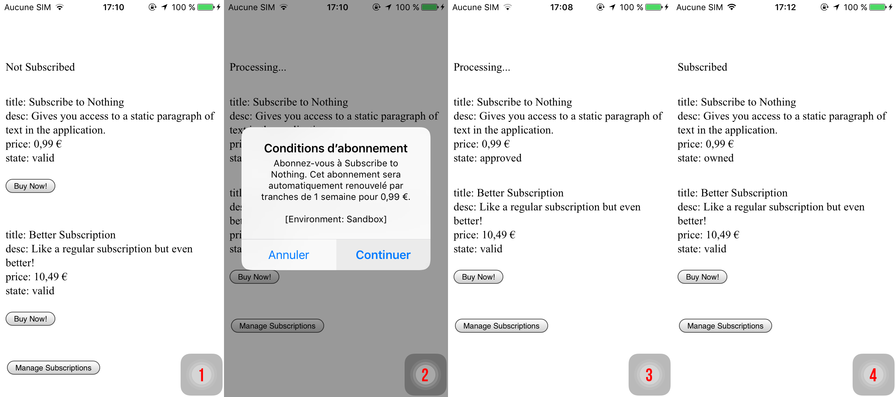

# Subscription on iOS

In this guide, we will build a small application with a subscription that works on iOS.

On iOS, the plugin supports simple subscriptions and subscriptions groups. Introductory prices and promotional offers are supported yet.

Here's what we will build: a simple application to manage a subscription with 2 different levels (basic subscription, and better subscription).



Let's dig into this.
We will proceed in 4 steps: setup, initialization, presentation and purchase.

Here what we'll do.

1. Install Dependencies
2. Create Cordova Project
3. Setup AppStore Application
4. Install and Prepare with XCode
5. Create In-App Products
6. Prepare Test Accounts

Of couse you can skip the first few steps if you already have a working application you want to integrate the code into.

Once we have a Cordova iOS application with IAP support enabled and everything is in place on AppStore Connect, we will get into some coding.

1. Initialize the in-app purchase plugin
2. Handle the purchase events
3. Deliver our product
4. Secure the transactions


## Setup

### 1. Install Dependencies

Needless to say, make sure you have the tools installed on your machine. Developing from a mac is generally recommended for doing iOS development, it's way easier. If you only plan on doing Android, then everything will work.

During the writing of this guide, I've been using the following environment:

* **NodeJS** v10.12.0
* **Cordova** v8.1.2
* **macOS** 10.14.1

I'm not saying it won't work with different version. If you start fresh, it might be a good idea to use an up-to-date environment.

### 2. Create Cordova Project

#### Create the project

If it isn't already created:

```text
$ cordova create CordovaProject cc.fovea.purchase.demo PurchaseNC
Creating a new cordova project.
```

For details about what those parameters are:

```text
$ cordova help create
```

Note, feel free to pick a different project ID and name. Remember whatever values you put in here.

Let's head into our cordova project's directory \(should match whatever we used in the previous step.

```text
$ cd CordovaProject
```

#### Add iOS platform

```text
$ cordova platform add ios
```

### 3. Setup AppStore Application

First, I assume you have an Apple developer account. If not time to register, because it's mandatory.

Let's now head to the [AppStore Connect](https://appstoreconnect.apple.com) website. In order to start developing and testing In-App Purchases, you need all contracts in place as well as your financial information setup. Make sure there are no warning left there.

I'll not guide you through the whole procedure, just create setup your Apple application as usual.

#### Retrieve the Shared Secret

Since you are here, let's retrieve the Shared Secret. You can use an App-Specific one or a Master Shared Secret, at your convenience: both will work. Keep the value around, it'll be required, especially if you are implementing subscriptions.


### 4. Install and Prepare with XCode

When you only require iOS support, no need for special command line arguments:

```text
$ cordova plugin add cordova-plugin-purchase
```

You then have to activate the In-App Purchase capability manually for your application using Xcode. Unfortunately it's not something the plugin can do automatically. So let's first prepare the iOS project:

```text
$ cordova prepare ios
```

Then open the project on Xcode:

```text
$ open platforms/ios/*.xcodeproj
```

Get to the project's settings by clicking on the project's icon, which is the top-most item in the left-side pane tree view.

Select the target, go to _Capabilities_, scroll down to _In-App Purchase_ and make sure it's **"ON".**


Now try to **build the app from Xcode**. It might point you to a few stuff it might automatically fix for you if you're starting from a fresh project, like selecting a development team and creating the signing certificate. So just let Xcode do that for you except if you have a good reason not to and know what you're doing.

Successful build? You're good to go!

### 5. Create In-App Products

If you followed the [Setup AppStore Application](#3-setup-appstore-application) section, you should have everything setup. Head again to the App's In-App Purchases page: select your application, then _Features_, then _In-App Purchases_.

From there you can create your In-App Products. Select the appropriate type, fill in all required metadata and select _cleared for sale_.


Even if that sounds stupid, you need to fill-in ALL metadata in order to use the In-App Product in development, even the screenshot for reviewers. Make sure you have at least one localization in place too.


The process is well explained by Apple, so I'll not enter into more details.

### 6. Create Test Users

In order to test your In-App Purchases during development, you should create some test users.

You can do so from the AppStore Connect website, in the _Users & Access_ section. There in the sidebar, you should see "Sandbox > Testers". If you don't, it means you don't have enough permissions to create sandbox testers, so ask your administrator.

From there, it's just a matter of hitting "+" and filling the form. While you're at it, create 2-3 test users: it will be handy for testing.


### 7. Get a Receipt Validation Server

A proper implementation of subscriptions on iOS requires a receipt validation
server that'll get used to get the most up-to-date status of a users subscription.

Implementing your own is not in the scope of this guide, so we'll use
Fovea's dedicated service called Billing.

 1. Create an account on: [https://billing.fovea.cc](https://billing.fovea.cc/).
 2. Fill in the information for iOS: your **Bundle ID** and the **Shared Secret**.

Once this is done, you can visit the documentation page, keep it around for when
we'll start the implementation: we'll have to copy-paste the
`store.validator = ...` line into the code.


The service is free for sandbox receipts validation. When you get to production
you need to upgrade to a paid plan (see [pricing](https://billing.fovea.cc/pricing/)).



## Coding


### Initialization

Assuming you're starting from a blank project, we'll add the minimal amount of HTML for the purpose of this tutorial. Let's replace the `<body>` from the `www/index.html` file with the below.

```markup
<!DOCTYPE html>
<html>
<head>
  <meta http-equiv="Content-Security-Policy" content="default-src 'self' https://reeceipt-validator.fovea.cc 'unsafe-eval' 'unsafe-inline' gap:; style-src 'self' 'unsafe-inline'; media-src *">
</head>
<body style="margin-top: 50px">
  <script type="text/javascript" src="cordova.js"></script>
  <script type="text/javascript" src="js/index.js"></script>
</body>
</html>
```

Make sure to comment out Cordova template project's CSS.

We enabled the `'unsafe-inline'` `Content-Security-Policy` by adding it to the `default-src` section.

Since we'll be using [Fovea.Billing](https://billing.fovea.cc), you also need to add your validation server to default-src, find your in the [cordova setup documentation](https://billing-dashboard.fovea.cc/setup/cordova). On my case it's `https://reeceipt-validation.fovea.cc`.

Let's now or edit the JavaScript file `js/index.js`. Replace the content with the code below, which will setup a minimal application framework and render some HTML into the page based on the app state.


```javascript
document.addEventListener('deviceready', onDeviceReady);

function onDeviceReady() {

    const state = {};
    function setState(attr) {
        Object.assign(state, attr);
        render(state);
    }

    setState({
        error: '',
        status: 'Loading...',
        product1: {},
        product2: {},
    });

    // We will initialize the in-app purchase plugin here.

    function render() {

        const body = document.getElementsByTagName('body')[0];
        body.innerHTML = `
<pre> 
${state.error}

subscription: ${state.status}
</pre>
        `;
    }
}
```

Now let's initialize the in-app purchase plugin, where indicated in the `onDeviceReady` function.

```javascript

    // We should first register all our products or we cannot use them in the app.
    store.register([{
        id:    'my_subscription1',
        type:   store.PAID_SUBSCRIPTION,
    }, {
        id:    'my_subscription2',
        type:   store.PAID_SUBSCRIPTION,
    }]);

    // Setup the receipt validator service.
    store.validator = '<<< YOUR_RECEIPT_VALIDATION_URL >>>';

    // Show errors for 10 seconds.
    store.error(function(error) {
        setState({ error: `ERROR ${error.code}: ${error.message}` });
        setTimeout(function() {
            setState({ error: `` });
        }, 10000);
    });

    // Later, we will add our events handlers here

    // Load informations about products and purchases
    store.refresh();
}
```

Here's a little explanation:

We start by registering the product with ID `my_subscription1` and `my_subscription2`.

We declare the products as renewable subscriptions \(`store.PAID_SUBSCRIPTION`\). [⇒ API Documentation](https://github.com/j3k0/cordova-plugin-purchase/blob/master/doc/api.md#registering-products).

We setup the link to the receipt validation server. If you're using [Fovea.Billing](https://billing.fovea.cc), you'll [find it here](https://billing-dashboard.fovea.cc/setup/cordova).

We setup an error handler. It will display the last error message for 10 seconds on top of the screen.

Finally, we perform the initial `refresh()` of all product states. [⇒ API Documentation](https://github.com/j3k0/cordova-plugin-purchase/blob/master/doc/api.md#registering-products).


Whatever your setup is, you should make sure the initialization code is executed as soon as the javascript application starts. You have to be ready to handle IAP events as soon as possible.


### Presentation

Let's now display the subscription status, as it is provided by the native platform. Before the call to `store.refresh()` we will add an handler for the `update` event:

This hander is called whenever there's a change in our products' state.

```javascript
// Called when any subscription product is updated
store.when('subscription').updated(function() {
    const product1 = store.get('my_subscription1') || {};
    const product2 = store.get('my_subscription2') || {};

    let status = 'Please subscribe below';
    if (product1.owned || product2.owned)
        status = 'Subscribed';
    else if (product1.state === 'approved' || product2.state === 'approved')
        status = 'Processing...';

    setState({ product1, product2, status });
});
```

Now we can display some information about our products from the `render()` function:

```javascript
function render() {

    const purchaseProduct1 = '';
    const purchaseProduct2 = '';

    const body = document.getElementsByTagName('body')[0];
    body.innerHTML = `
<pre> 
${state.error}

subscription: ${state.status}

id:     ${state.product1.id          || ''}
title:  ${state.product1.title       || ''}
state:  ${state.product1.state       || ''}
descr:  ${state.product1.description || ''}
price:  ${state.product1.price       || ''}
expiry: ${state.product1.expiryDate  || ''}
</pre>
${purchaseProduct1}
<pre>

id:     ${state.product2.id          || ''}
title:  ${state.product2.title       || ''}
descr:  ${state.product2.description || ''}
price:  ${state.product2.price       || ''}
state:  ${state.product2.state       || ''}
expiry: ${state.product2.expiryDate  || ''}
</pre>
${purchaseProduct2}
    `;
}
```

Whenever anything happens to our product, the interface will now be updated to reflect the current state.


Displaying your product information this way, i.e. exactly as loaded from the Store, is required by Apple and Google. Do otherwise and they might simply reject your application.



You can also disconnect the event handler with `store.off()` so your subscription view is only updated when it's visible.


If you want a bit more background information about all of this, please check the introduction's [displaying products](../discover/about-the-plugin.md#displaying-products) section and the [⇒ API Documentation](https://github.com/j3k0/cordova-plugin-purchase/blob/master/doc/api.md#storeproduct-object) for full details about the fields found for a product.

### Purchase

So far so good, but what if we could actually initiate a purchase? To do so, we'll add a purchase button for both products. We already added placeholders for the purchase buttons, let's create them. Before displaying a purchase button, we need to make sure the user can actually purchase the item. It could be impossible for a few reasons: there's already a purchase in progress, the product is already owned, the feature is disabled for the user (Child Mode).

In our `render()` function, we update the code that initialized `purchaseProduct1` and `purchaseProduct2`.

```javascript
// button for product 1
const purchaseProduct1 = state.product1.canPurchase
    ? `<button onclick="store.order('my_subscription1')">Subscribe</button>` : '';

// same for product 2
const purchaseProduct2 = state.product2.canPurchase
    ? `<button onclick="store.order('my_subscription2')">Subscribe</button>` : '';
```


    The buy button should only be displayed when `product.canPurchase` is true. Otherwise, calling `store.order()` will generate an error.


We could make this a little nicer by changing the button labels to "Upgrade" or "Downgrade" when the other product is `owned`, I will let this as an exercise to the reader.

Now, let's build and test!


### Testing

To test on iOS with In-App Purchases enabled, I always chose to run my app through Xcode. This way, I can see the logs from both the javascript and native sides, which is useful.

To create a build, first update the Xcode project on the console, swith to Xcode and run.

```text
cordova prepare ios && open platforms/ios/*.xcodeproj
```

Run.


### Purchase Flow

We already added a "Buy" button. This button calls the `store.order()` method which initiates the purchase flow for a product.

At this point, the code starts the process but the purchase will remain "processing" forever, in the `approved` state.

For a product in the `approved` state, the transaction has been approved by the user's banking institution but it won't be finalized until you inform them to do so. You have to deliver whatever the user purchased before finalizing.

I already introduced the purchase flow in the introduction of this guide, you can check the [purchase process](../discover/about-the-plugin.md#purchase-process) section if you need a refresher. The official documentation provides even more details. [⇒ API Documentation](https://github.com/j3k0/cordova-plugin-purchase/blob/master/doc/api.md#-purchasing) 

When the user is done with the native interface \(i.e. has entered his/her password and confirmed\), your app receives the `approved` event. So let's add more handlers to the `onDeviceReady()` function, before the call to `store.refresh()`.

```javascript
store.when()
     .approved(p => p.verify())
     .verified(p => p.finish())
     .owned(p => console.log(`you now own ${p.alias}`));
```

That's enough for a local implementation (where we don't need to inform a server of changes to the subscription status). Let's try the whole thing now. Repeat the steps from the [testing](#testing) section above:

```text
cordova prepare ios && open platforms/ios/*.xcodeproj
```

Run from Xcode and here you go! You should be able to purchase your subscriptions.

Full source for this tutorial below:



```javascript
document.addEventListener('deviceready', onDeviceReady);

function onDeviceReady() {

    const state = {};
    function setState(attr) {
        Object.assign(state, attr);
        render(state);
    }

    setState({
        error: '',
        status: 'Loading...',
        product1: {},
        product2: {},
    });

    // We should first register all our products or we cannot use them in the app.
    store.register([{
        id:    'my_subscription1',
        type:   store.PAID_SUBSCRIPTION,
    }, {
        id:    'my_subscription2',
        type:   store.PAID_SUBSCRIPTION,
    }]);

    // Setup the receipt validator service.
    store.validator = '<<< YOUR_RECEIPT_VALIDATION_URL >>>';

    // Show errors for 10 seconds.
    store.error(function(error) {
        setState({ error: `ERROR ${error.code}: ${error.message}` });
        setTimeout(function() {
            setState({ error: `` });
        }, 10000);
    });

    store.when()
        .approved(p => p.verify())
        .verified(p => p.finish())
        .owned(p => console.log(`you now own ${p.alias}`));

    // Called when any subscription product is updated
    store.when('subscription').updated(function() {
        const product1 = store.get('my_subscription1') || {};
        const product2 = store.get('my_subscription2') || {};

        let status = 'Please subscribe below';
        if (product1.owned || product2.owned)
            status = 'Subscribed';
        else if (product1.state === 'approved' || product2.state === 'approved')
            status = 'Processing...';

        setState({ product1, product2, status });
    });

    // Load informations about products and purchases
    store.refresh();

    function render() {

        const purchaseProduct1 = state.product1.canPurchase
            ? `<button onclick="store.order('my_subscription1')">Subscribe</button>` : '';
        const purchaseProduct2 = state.product2.canPurchase
            ? `<button onclick="store.order('my_subscription2')">Subscribe</button>` : '';

        const body = document.getElementsByTagName('body')[0];
        body.innerHTML = `
<pre> 
${state.error}

subscription: ${state.status}

id:     ${state.product1.id          || ''}
title:  ${state.product1.title       || ''}
state:  ${state.product1.state       || ''}
descr:  ${state.product1.description || ''}
price:  ${state.product1.price       || ''}
expiry: ${state.product1.expiryDate  || ''}
</pre>
${purchaseProduct1}
<pre>

id:     ${state.product2.id          || ''}
title:  ${state.product2.title       || ''}
descr:  ${state.product2.description || ''}
price:  ${state.product2.price       || ''}
state:  ${state.product2.state       || ''}
expiry: ${state.product2.expiryDate  || ''}
</pre>
${purchaseProduct2}
        `;
    }
}
```



```markup
<!DOCTYPE html>
<html>
<head>
  <meta http-equiv="Content-Security-Policy" content="default-src 'self' https://reeceipt-validator.fovea.cc 'unsafe-eval' 'unsafe-inline' gap:; style-src 'self' 'unsafe-inline'; media-src *">
</head>
<body style="margin-top: 50px">
  <script type="text/javascript" src="cordova.js"></script>
  <script type="text/javascript" src="js/index.js"></script>
</body>
</html>
```



